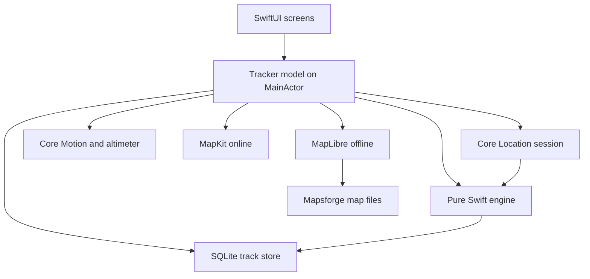
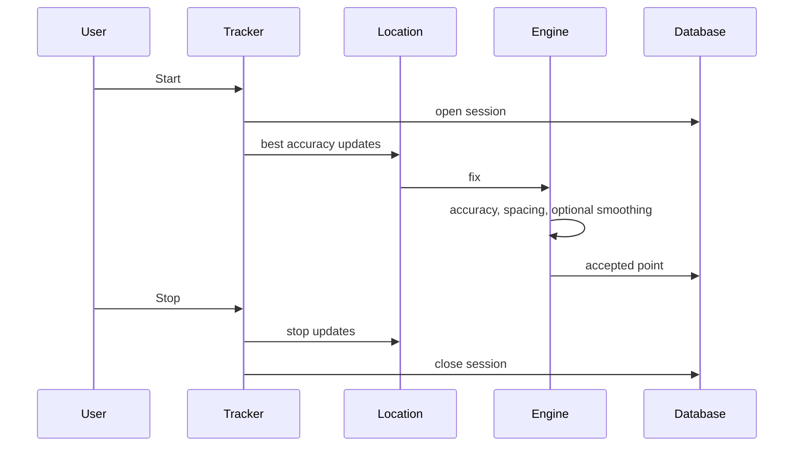

# GPS Track Logger

[Magyar](README-hu.md)

GPS Track Logger records a route on the iPhone and keeps the points in an on-device database. Saved tracks can be shared as GPX 1.1 or KMZ.

The Xcode project is `gtl.xcodeproj`. Sources live in `gtl/`. The shared scheme is `gtl`.

## Requirements

- Xcode with the iOS 17 SDK or newer
- An iPhone simulator, or an iPhone running iOS 17 or newer
- Swift 6

## Version and identity

| | |
| --- | --- |
| Display name | GPS Track Logger |
| Hungarian home-screen name | GTL GPS útvonal napló |
| Bundle identifier | `com.lkovari.mobile.apps.gtl` |
| Version | 2.0.15 |
| Build | 33 |
| Devices | iPhone only, portrait |
| Languages | English and Hungarian, following the system language |
| Appearance | Light and dark, following the system |

Signing is automatic and the development team is unset, so the simulator builds without a paid account. Archive and upload need the Apple Developer Program team selected in Xcode under Signing & Capabilities.

## Build, test, and run

Open `gtl.xcodeproj` and run the `gtl` scheme on an iPhone simulator.

From the command line, using an installed iPhone simulator:

```sh
xcodebuild -project gtl.xcodeproj -scheme gtl \
  -destination 'platform=iOS Simulator,name=iPhone 17' \
  -packageAuthorizationProvider netrc \
  CODE_SIGNING_ALLOWED=NO \
  test
```

If that simulator name is not installed, pick one from:

```sh
xcrun simctl list devices available
```

The unit tests cover recording filters, spacing, smoothing, barometric altitude, exports, and map math. The UI test launches the app, accepts the disclaimer, and checks that the tracker is on screen.

## Architecture



Recording stays off until a session starts. Location, motion, and the barometer run only while that session is open. Heading updates run for the Compass tab, and for the on-map pointer during a session.



## Screens

The first launch shows a disclaimer. Accept is stored on the device. Refuse closes the app.

The tracker has GPS, Route, Map, and Compass. The menu opens Settings, offline map downloads, saved tracks, Help, About, and Location settings. Tapping the version line on About seven times opens the error log.

GPS and Route use the same instrument language as the compass. Light and dark follow the system, on the same background as the other tabs. The readings are unchanged. What changed is how they are set on the screen.

### GPS

The GPS tab is a position plate.

A dot and one sentence sit at the top. Logging is teal in light mode and cyan in dark mode. Poor GPS while logging is amber. Location off, or Precise Location required, is carmine, the same color as north on the compass. Idle and waiting for a fix use the secondary color. The sentence is one of: Logging, GPS quality is too low, Location is off, Precise location is required, Waiting for GPS, Idle. Hungarian: Naplózás, A GPS minősége túl alacsony, A helyzet ki van kapcsolva, Pontos hely kell, Várakozás a GPS-re, Üresjárat.

When location is denied or restricted, or Precise Location is still required, the explanation and a carmine Location settings button sit under that sentence. The button opens the existing Location settings screen.

Latitude and longitude are the large numbers, six decimal places, with a degree sign. North is carmine. South, east, and west use the primary text color. With no fix, each line is a dash and the hemisphere letter is hidden.

Accuracy is the next number, in metres. At 15 m or better it uses teal, or cyan in dark mode. From there through 40 m it uses the primary text color. Worse than 40 m it is amber. No accuracy is a dash.

A hairline separates that plate from a two-column reading. The value sits above its name. The pairs are GPS altitude and baro, ellipsoid and pressure, vertical accuracy and fix age. Fix age updates every second. A missing value is a dash. When the fix-cloud switch is on, n, RMS, and CEP95 follow on one row.

### Route

The Route tab is a trip instrument. Speed is the face: a large rounded number, with the unit from Settings under it. While logging, the number uses the primary text color and the unit is teal, or cyan in dark mode. While idle, both are secondary, and the speed is 0. The average under it is 0 in the same case.

Under a hairline, elapsed time and the odometer sit beside time moving and waiting, split by a vertical rule. Another hairline, then altitude, bearing, and lean in one row. Ambient stays “No sensor” (Nincs érzékelő). This phone has no temperature sensor, and that line is quieter than the other readings.

The elevation profile appears only after two points have a GPS altitude. It is a carmine line with a soft fill under it, and a dot on the latest point. The low and high altitudes of the plot sit on the left. Two faint horizontal guides and a baseline sit behind the line. When pressure samples exist, a dashed teal line, cyan in dark mode, is barometric altitude, and a short legend names GPS altitude and Baro. Without those two altitudes the profile is not drawn, so an empty chart does not fill the screen.

Settings cover usage (Aircraft, Watercraft, Car, Motorbike, Bicycle, Run/Hike), metric / imperial / ICAO units, appearance, recording density, the barometer when the phone has one, and the layer switches for the map that is in use.

Saved tracks can be shared as GPX or KMZ, shown on the map, or deleted.

## Maps

Online maps use MapKit: standard, satellite, and hybrid, each with realistic elevation. While logging, the camera tilts and turns with the direction of travel. The track is colored by speed. A map tap can request a walking, cycling, or driving route from Apple. Place search on the online map uses MapKit local search.

How to use the camera, the speed colors, KMZ altitude, and a route from a map tap is in [Map features](#map-features) below.

Offline maps use one downloaded region at a time:

- OpenStreetMap regions from `https://download.mapsforge.org/maps/v5/`, with a 2 GB cap and a 64 MB free-space reserve
- Turistautak.hu from `https://turistautak.elte.hu/tuhu/tuhu_mapsforge.zip` only

A download reads the real file size first. It does not start when the size cannot be read, the file is over the cap, or free space minus the 64 MB reserve is not enough. On a mobile network the size is confirmed before the download starts. While it runs, the download stops if the bytes written would pass free space minus the reserve, or the cap. Downloaded map files are excluded from device backup.

MapKit cannot draw those files. The app reads the visible tiles from the Mapsforge file and draws them with MapLibre Native (BSD 2-Clause). Decoding runs off the main thread and is cancelled when the camera moves. Memory holds at most 48 tiles and 64 MB of decoded map, and tiles behind the camera are dropped, so a long trip uses the same map memory as a short one. The map file stays on disk. When the screen locks, another tab is selected, or the app switcher opens, those tiles and the open file are released. Coming back loads only the current view. The place index is built in batches while nothing is being recorded and the map is visible, then the file is closed. MapLibre is created only while an offline map is in use. About also shows the MapLibre copyright lines.

At a close zoom one Mapsforge tile is larger than the phone screen. The tile id is the file’s base zoom, not the screen zoom. Ways sit in zoom rows. In the Hungary file the street network is in the first row (z12), footways in z13, service roads in z14, and buildings in z15. A row is not ordered by where the way lies on the ground. Keeping the first few hundred ways can therefore fill one corner only. That is the map of short fragments, empty rectangles, or a single band along the bottom of the screen with the position marker on blank ground.

The decoder keeps ways that cross the screen, with a margin of about half a screen, at every zoom. Each way carries a 16-bit sub-tile bitmap, the tile’s 4×4 grid two zoom levels down. A way whose bits miss the view is skipped before its coordinates are read. A coastline has every bit set, so it stays. Of the ways that remain, roads, railways, and waterways take about 60 percent of the budget, land and water fill about 20 percent, and buildings and other lines take the rest. No part of the road budget is reserved for the screen’s own zoom row any more, because the streets live in the coarser rows.

The zoom row asked from the file is the MapLibre zoom plus one. MapLibre counts with 512-point tiles, so its zoom 14 shows the scale of a classic zoom 15, and the Mapsforge rows are made for the classic scale.

A close view (file zoom 12 and above, read from the base-14 sub-file) has a per-tile cap of 4000 when one or two tiles cover the view, 2500 up to six tiles, and 1200 above that. A tile larger than 4 MB is not loaded whole.

An overview (file zoom 11 and below, or any view that falls back to the base-5 or base-10 sub-file) no longer keeps every eighth way by position. It reads every way of the rows up to the screen zoom, keeps those that cross the screen, and drops what the map does not draw. At most 12,000 features are kept in total. When a tile has more than its share, the order is: motorway, trunk, and the country border first, then primary, water, secondary, tertiary and rail, link roads, land cover by size, and the remaining roads. The country border (`admin_level=2`) has its own line.

A tile already in memory is decoded again when the screen zoom is higher than the zoom it was decoded for, or when the part of the tile now on screen falls outside the area that decode covered. A small pan inside the margin does not decode again. The tile closest to the center of the screen stays even if larger tiles ahead of the direction of travel would otherwise fill the 64 MB cap. Tiles are decoded one at a time, off the main thread. Moving the camera starts a new job, but a tile that is already being decoded is finished and kept. The map updates as tiles arrive, at most every 0.4 seconds, and once more at the end. The GeoJSON source is replaced in place. It is not cleared first, and MapLibre’s own tile cache stays on. Clearing the shape or turning that cache off left a blank map and did not shrink the live memory, which is the open map’s GPU surfaces and MapLibre threads. Instruments’ multi-gigabyte total counts allocations that were already freed.

The failure and each step are written up in `osm-rendering-problem-hu.md`.

Four later fixes in the same decoder, with the measurements, are in `rendering-fix-hu.md` (Hungarian):

- **A grid along tile edges.** The Mapsforge writer puts a `natural=sea` and a `natural=nosea` rectangle into every tile, covering the tile. They exist for drawing coastlines. The reader did not know them and treated every unknown way as a road, so the rectangles were drawn as white roads on the tile border. While zooming this showed as a grid, and as large rectangles at country scale. The reader now drops those two rectangles. Only a way with a `highway` tag, or a railway, is drawn as a road. A fence, a power line, a boundary, or a parking outline is not.
- **Recording stopped on a locked screen with an offline map.** The place index kept working in the background, because it checked for cancellation only between two tiles, and one large tile takes more than half a minute. In the background iOS allows 80 percent CPU over 60 seconds. The phone’s log shows the index at 98 percent, and recording stopped in the second the limit was passed. The process stayed alive and memory did not run out. With a MapKit map the index does not start, and there was no gap. Cancellation is now checked inside the way and POI loops, every 256 items, in the index and in tile decoding.
- **A wasted allocation per way.** For every way the reader joined all way tags of the file (339 tags, 5.6 KB in the Hungary file) to decide whether the map is a hiking map. That was close to half of the allocation volume measured in Instruments. The flag is now computed once, when the header is read.
- **Tags with a variable value.** In Mapsforge all tag ids of a way come first, and the values follow (`building:levels`, `height`, `roof:colour`). The reader read the value right after its id. When the variable tag was not the last one, the remaining tags, the name, and the geometry were shifted. In the measured tiles this hit 0.4 percent of the ways, nearly all buildings.

Three more fixes followed, after zoomed-out views showed scattered road fragments, a blank rectangle in the land cover, and a picture that stayed wrong for a minute:

- **Overview sampling.** Below file zoom 12 the reader kept every eighth way of the tile by position, whatever it was. At country scale that left motorway crumbs, and a land polygon that fell out of the sample left a sharp-edged hole. Replaying the same view on the real file gave 6 roads in that hole at zoom 11 and 156 at zoom 12. The overview now filters to the screen and ranks by class, as described above.
- **Zoom shifted by one.** The reader was asked for the MapLibre zoom itself. At the opening zoom of 14 the building row (z15) was not requested, although the scale already was zoom 15.
- **Only a cross-shaped patch was drawn when zoomed out.** A view could ask for more tiles than the 24 the cache held. The reader then kept the 24 nearest and left the rest of the screen blank, which drew a diamond around the center. The cap is now 48 tiles, and a view that needs more than that always falls back to the next coarser sub-file, so the whole screen is covered. At the widest views that means motorways, trunk roads, and the country border only.
- **Finished tiles were lost.** A camera move cancelled the running decode and threw its result away, and tiles stored by an interrupted run were never published when the next call found nothing missing. Pressing the zoom button several times in a row hit both. An in-flight tile is now finished and kept, and anything stored but not yet shown is published on the next call.

The road budget also changed: three quarters of it used to be reserved for the screen’s zoom row, which at zoom 16 holds only steps. Streets from the coarser rows were limited to 300 per tile. The reservation is gone.

Still open: the decoder builds a tag dictionary per way and is slower than it needs to be, and the track overlay is rebuilt on every fix. See items 2 and 6 in `rendering-fix-hu.md`. None of this has been verified on a long drive yet.

An offline OSM map shows `© OpenStreetMap contributors` in the corner. A Turistautak map shows `© Turistautak.hu`, and About links to the site and its terms. Hillshade is drawn only when elevation files sit next to the map.

Place search on an offline map uses an on-device index. Queries start at 3 characters and return at most 5 hits.

## Privacy

The privacy manifest declares precise location for app functionality. Required Reason API reasons: UserDefaults `CA92.1`, file timestamp `C617.1`, and disk space `E174.1`. The app does not track. `ITSAppUsesNonExemptEncryption` is false.

The logged route, acceleration, and lean angle stay in SQLite on the phone. An iPhone backup includes that database. Downloaded map files are excluded from backup. The map, search, a route, and an address send Apple the coordinate or map area needed for that request. An OSM or Turistautak download lets that server see the IP address and the requested file. The logged track is not uploaded to the developer’s server. The first screen and the Help usage section say the same thing.

Privacy policy: `https://lkovari.github.io/KLHome/assets/bigfiles/gtl-ios-private-policy.html`. Use that same address as the App Store Connect Support URL. The source is `docs/gtl-ios-private-policy.html`; copy it to the KLHome site before submission. About also shows `laszlo.kovary@gmail.com`. The link is on the first screen, in Settings, and in Help.

Refuse on the first screen does not quit the app. Recording stays off until Accept. While location is When In Use, Start explains why Always is needed for a locked screen; choosing only while using the app starts without an Always request. Recording does not start on reduced accuracy until Precise Location is allowed. If location is denied, the GPS tab opens Location settings.

Purpose strings, in English and Hungarian:

- Location when in use
- Location always and when in use
- Motion
- Temporary precise location for the route (`PreciseRoute`)

The only background mode is Location. What happens when the screen locks is in [Logging on a locked screen](#logging-on-a-locked-screen).

## What changed from the previous behavior

These changes are here because of App Store review. Recording, the map, saved tracks, and export are still there. A few actions that used to run immediately now pass a check or a choice first. When the condition is met, the action continues as before.

### Refuse

Refuse on the first screen used to call `exit(0)` and end the process. iOS has no Quit on the interface: the system ends the process. Review sends that back under a finished, usable app and under design.

The button now stays on the disclaimer. A line says recording stays off until the user accepts. Accept still writes the `disclaimer` UserDefaults key, then opens the tracker.

### Opening text and Help

The first screen and the Help usage paragraph used to say that location is not sent to a server, or that nothing is uploaded. The Map section of Help already said that a route or address request sends a coordinate to Apple. The three texts contradicted each other. The guideline says the user must not be misled about whether data leaves the device.

Both places now say the two facts separately. The logged track is not uploaded to the developer’s server. The map, search, a route, and an address send Apple the coordinate needed for that request. The Map help sentences are unchanged. They were the model.

### Privacy policy link

The link used to live only in a Help row that starts collapsed, and the label was the host name. A reviewer looks at the first screen and at Settings. The guideline asks for the policy somewhere easy to reach inside the app.

The same URL is now on the first screen, in Settings, and in Help. The label in all three places is “Privacy policy” or “Adatvédelmi nyilatkozat”. The address is `https://lkovari.github.io/KLHome/assets/bigfiles/gtl-ios-private-policy.html`. The page source is `docs/gtl-ios-private-policy.html`. Copy that file to the KLHome site before submission, or the reviewer still reads the old Android text. The App Store Connect Support URL field should be this same page.

The page describes the iOS data flow: the route, acceleration, and lean angle stay in SQLite on the phone; backup includes the track database and excludes downloaded map files; MapKit, search, a route, and an address send Apple a coordinate or the map area; an OSM or Turistautak download lets that server see the IP address and the requested file; background location runs only while logging and only with Always; there is no account, no ads, and no tracking.

### Privacy manifest

The manifest used to declare only the UserDefaults reason (`CA92.1`). The place index reads a map file’s modification time, and the download reads free disk space before it starts. Those are required-reason APIs. A missing declaration stops the upload with ITMS-91053, and the build never reaches review.

Precise location remains, for app functionality, not linked, not used for tracking. File timestamp `C617.1` and disk space `E174.1` were added. That does not change the steps a user takes. The resolved MapLibre 6.31.0 framework ships its own `PrivacyInfo.xcprivacy`, so no extra manifest was written into it.

### Always permission

If location was only While Using the App, Start used to open the system Always dialog immediately and start the session in the same step. The user did not see an in-app sentence, before that dialog, saying that locked-screen recording is why Always is needed.

Start now shows an in-app sheet. The sheet says locked-screen recording needs Location set to Always, the blue indicator stays until Stop, and Stop ends background updates. Allow Always then calls the system Always prompt and starts the session. Only while using the app starts on-screen recording without an Always request. If the user grants Always later, the same session turns on background updates and the blue indicator. When Always is already granted, Start still records immediately, without the sheet, because the system prompt is not due.

### Reduced accuracy

The user could choose approximate location in the system dialog. Recording still started, and the track was made of unusable points.

If accuracy is reduced, logging now asks the system for temporary full accuracy first. The purpose key is `PreciseRoute`: precise location is required to record a usable route, in English and Hungarian. If the user does not grant it, the session does not start. The GPS tab says Precise Location is required in Settings, and a button opens the existing Location settings screen.

### Denied location

In the denied or restricted state, Start used to write into a status field no view showed, and the GPS tab said “Waiting for GPS”. The button looked dead.

The GPS tab now says location is off, and a button opens the existing Location settings screen. That screen opens the system Settings. Those branches no longer write a second, hidden English status.

### Offline map download

The free-space check used to run with a length of 0 bytes. If more than 64 MB was free, the download started without the real file size. The background download could use the mobile network with no confirmation and no size on screen. While it ran, cancellation was at the 2 GB OSM cap or the 500 MB Turistautak cap, not at the space still free. Two of the app’s own errors were English only.

A download now sends a HEAD request and reads `Content-Length` first. The Hungary OSM file and the Turistautak zip return that header. If the length cannot be read, the file is over the cap, or free space minus the 64 MB reserve is not enough, the download does not start, with an error in English and Hungarian. On a mobile network a confirmation is required, with the region name and the expected size. After confirmation, mobile data stays allowed. On Wi-Fi the confirmation is skipped, and the download starts when the size and the free space are enough. While it runs, the download stops if the bytes written pass the budget taken at the start, or if free space falls under the reserve. A `URLSession` error is still in the system language.

### Backup

The track database and the map files both lived in Application Support, so an iPhone backup, including iCloud, could copy both. The policy and the binary have to describe the same fate for precise location.

The track database is still included in backup. The policy says so. The Exports folder stays in the Files app, because the user saved that copy on purpose. The `maps` directory and a downloaded map file get `isExcludedFromBackup`, because a country file is hundreds of megabytes and does not belong in a backup.

### Map credit and About

The offline OSM corner used to say `© OpenStreetMap`. ODbL asks for `© OpenStreetMap contributors` on the produced work, on the screen where the map data is visible. That is the corner text while a downloaded OSM file is in use. The ODbL sentence in About is unchanged.

The Turistautak corner is still `© Turistautak.hu`. About adds that their terms require a clear reference to the site wherever the data is shown, and that the file is saved on this phone for the user’s own use. There is a link to `https://turistautak.hu` and to the legal notice. The download stays in the build, because the terms allow saving for personal use when the reference is visible.

About gained a MapLibre row: MapLibre Native, BSD 2-Clause, and the copyright lines from the 6.31.0 package (MapLibre contributors, MapTiler.com, Mapbox). Binary distribution requires that text. Support is new: the privacy policy link and `laszlo.kovary@gmail.com`. The Bitbucket repository row remains. It is not the support contact. The App Store Connect Support URL is the privacy policy page, not the repository root.

### What stayed the same

After Accept, the tracker still opens. With Always, locked-screen recording and the blue indicator until Stop are unchanged. While Using the App, locking the screen still stops new points. Online MapKit, place search, a route from a tap, an address, saved tracks, and GPX and KMZ export are in the same places. The track database stays on the phone, and backup includes it.

## A real iPhone

The simulator can show the screens and a simulated GPS location. These need a physical iPhone:

- A continuous track while the screen is locked
- Barometric altitude
- A usable compass heading

## Not available on iPhone

- Ambient temperature. The temperature row says that no sensor is available, and temperature is not stored.
- A separate terrain raster basemap. Realistic elevation is the MapKit terrain, not a hillshade image. Offline maps stay flat.

## Map features

These notes describe the terrain camera, direction-up tracking, speed colors, KMZ altitude, and the route from a map tap. The same steps are on the Help screen, in the language of the phone.

### 3D terrain and a tiltable camera

Apple Maps standard, satellite, and hybrid use realistic elevation. No API key is required. While a session is logging, the camera starts at about 52 degrees of pitch, inside the 45–60 degree range. Two fingers tilt the map, and that pitch is kept on the next follow, clamped between 0 and 65 degrees. Satellite and hybrid then read like a navigation app.

Tap the north dial to put the pitch back to 52 degrees and turn direction-up on again.

Keep whole track on screen stays a flat, north-up view so the whole line fits.

A downloaded OSM or Turistautak map can tilt and follow heading. It has no elevation mesh, so the ground stays flat. Hillshade still appears only when elevation files sit next to that map.

### Direction-up tracking

While logging, the camera heading follows the direction of travel, and the position arrow turns with it. At 1 m/s or faster the GPS course is the direction. Below that, the compass geographic heading is used. A weak compass keeps the last good direction instead of spinning the map. The arrow points up the screen when the camera is direction-up.

The north dial rotates so N still points north.

### Speed-colored track

Each stored point already has a speed. The line uses up to six colors, slow to fast: blue `#3D5AFE`, teal `#1F8A80`, yellow `#F2C14E`, orange `#E07A3D`, carmine `#C13B2E`, deep red `#7A1530`. The dots on the map are the scale for the current usage. They appear only while a colored line is on the map. The list shows each band in the chosen unit, and it stays open unless that is turned off in Settings. Then the dots remain: a tap shows the bands, and another tap hides them. The HUD speed number uses the color of the current band. A speed below a cut stays in the slower band. The bands are fixed for the current usage, so a new maximum speed does not repaint the line already drawn.

Run:

- blue below 3.6 km/h
- teal 3.6–5.8 km/h
- yellow 5.8–7.9 km/h
- orange 7.9–10.8 km/h
- carmine 10.8–14.4 km/h
- deep red above 14.4 km/h

Hike and walking:

- blue below 3.6 km/h
- teal 3.6–5.8 km/h
- yellow 5.8–7.9 km/h
- orange 7.9–10.8 km/h
- carmine above 10.8 km/h

Bicycle:

- blue below 10.8 km/h
- teal 10.8–21.6 km/h
- yellow 21.6–28.8 km/h
- orange 28.8–39.6 km/h
- carmine 39.6–50 km/h
- deep red above 50 km/h

Car and motorbike:

- blue below 28.8 km/h
- teal 28.8–50.4 km/h
- yellow 50.4–79.2 km/h
- orange 79.2–118.8 km/h
- carmine 118.8–130 km/h
- deep red above 130 km/h

Aircraft:

- blue below 100 km/h
- teal 100–200 km/h
- yellow 200–350 km/h
- orange 350–500 km/h
- carmine 500–600 km/h
- deep red above 600 km/h

Watercraft:

- blue below 7.2 km/h
- teal 7.2–18 km/h
- yellow 18–28.8 km/h
- orange 28.8–43.2 km/h
- carmine above 43.2 km/h

A missing speed uses the slowest color. A saved track uses the same colors. Simplify only thins the drawn line; the kept points keep their speed. The stored route and the GPX or KMZ file still contain every accepted point.

### KMZ with real altitude

GPX already writes GPS altitude in `ele`. KMZ now does the visual half: when any point has a finite GPS altitude, the line and the Google Earth track use `altitudeMode` absolute and that altitude in the coordinate. A point without altitude is written as 0. Start, pause, and stop icons stay clamped to the ground.

If the track has no altitude at all, the line stays clamped to the ground.

Open the KMZ in Google Earth to see the line lifted off the terrain. This is the useful view for a flight or a mountain hike. Google Earth measures absolute altitude from the WGS84 ellipsoid. The phone stores altitude relative to sea level, so the line can sit a few tens of metres above or below the drawn terrain. The file is not converted.

Share from Saved tracks. The file lands in the Files app under On My iPhone → GPS Track Logger → Exports.

### Route to a tapped point

Tap the map, then Route. MapKit draws a walking, cycling, or driving path from your fix to that point. Hike and run use walking, bicycle uses cycling, and car and motorbike use driving. Aircraft and watercraft have no matching road mode, so the card offers Walk, Bicycle, and Car.

The request needs a network. It sends the two coordinates to Apple. The logged track is still stored only on the phone. Without a fix the card says No GPS. Without a path it says No route.

The path is a blue dashed line, separate from the speed-colored track and from the straight-line Distance tool. Tap the route chip to clear it. Starting another route cancels the request that is still running.

### Logging on a locked screen

Start records in the foreground as soon as location is allowed. The track continues after the screen locks only when Location is Always. The blue indicator stays until Stop. If Always is granted during that same Start, background recording turns on immediately. While Using the App, locking the screen stops new points, and a line under the title says so. Settings → Recording → Keep screen on while logging only keeps the display awake. It does not replace Always.

### Prevent Possible Crash

A long Run or Hike with the map in front can quit with an empty app error log. The screen locks, the tilted realistic map keeps following, and every accepted point used to rebuild the colored line. iOS can then stop the process for memory, or MapKit can die as the phone unlocks. The recording itself is not what quits.

While a session is logging and the scene is not active — the lock screen, the app switcher, or Control Center — the track keeps going. Location updates, the background activity session, accepted points, smoothing, barometer calibration, and the SQLite write still run when Location is Always. Motion and the barometer still sample ten times a second. Each saved point still stores the latest lean and pressure. Those samples are not pushed to the screen.

The map stays in place. It is not taken down and built again, which is what used to crash MapKit on unlock. It does not receive a new camera, and the compass does not turn it. Position, heading, speed, the colored line, the live tail, the fix cloud, and the HUD totals stay on the last frame. A stray camera callback does not write the heading or the pitch back.

When the scene is active again, that held state is published once and the camera follows once, to the latest position. Camera poses from the locked interval are dropped.

The colored line is no longer rebuilt from the whole track on every point. A point of the same speed color extends the last segment and keeps that segment's identity. A new color starts a new segment and shares the join point. Above three hundred segments, the shortest one is absorbed into a neighbor, and that neighbor keeps its identity. Only the open segment changes shape. Vertices inside a color are simplified with Douglas–Peucker. With line optimization off, the tolerance is the usage default: 2 m for Run and Hike. With optimization on, the tolerance is the slider, still applied inside each color, so a later point cannot renumber the segments already drawn. The whole line is rebuilt only when a saved session is loaded, the map track is cleared, or the usage or the settings change.

The stored track is still every accepted point, including a Run or Hike point about every 0.5 m. Statistics, the elevation profile, GPX, and KMZ use that full list. The elevation chart is built when the Route tab is shown and when a locked session returns to the foreground, not on every point while the Map tab is up. Each new sample updates the running totals, so distance and elapsed time on the map HUD still tick while the screen is on.

With the screen on, the follow camera is unchanged: about 52 degrees of pitch, GPS course at 1 m/s or faster, compass below that, 5 degree steps, and Keep whole track on screen. Start, Stop, Always, the locked-screen warning, and the idle timer are unchanged.

### App Store images

The App Store has no Google Play feature-graphic slot (1024×500). For this iPhone app the required image set is the 6.9-inch screenshot row. The icon ships inside the build and is not uploaded on its own. An iPad set is not required: the target is iPhone only (`TARGETED_DEVICE_FAMILY = 1`). When the 6.9-inch row is present, Apple scales it for 6.5-inch and smaller displays, so those files are optional.

The review note, with file ranges and the fix for each item, is [gtl-ios-review-hu.md](gtl-ios-review-hu.md) (Hungarian).

#### Where each file goes

| File | Size | App Store Connect |
| --- | --- | --- |
| `docs/images/app-store/iphone-6.9-inch/en/01-map.png` through `04-saved-tracks.png` | 1320×2868 PNG, RGB, no alpha | The iOS version → Screenshots → 6.9" Display, English localization. Order: 01, 02, 03, 04. |
| `docs/images/app-store/iphone-6.9-inch/hu/` the same four names | 1320×2868 PNG, RGB, no alpha | The same 6.9" slot, Hungarian localization. |
| `docs/images/app-store/app-icon/app-icon-1024.png` | 1024×1024 PNG, RGB, no alpha, no pre-rounded corners | Not a separate field. The uploaded build supplies the icon. To adopt this file, replace `gtl/Assets.xcassets/AppIcon.appiconset/AppIcon.png`. |

One localization needs 1 to 10 screenshots. This set has four, portrait, because the app is portrait only.

#### What the four images show

1. `01-map.png` — Map while logging, speed-colored line, HUD, north dial.
2. `02-route.png` — The file still shows the old row list and a boxed elevation line. The running Route tab is the speed face, the trip figures, and the elevation profile in [Route](#route). Recapture this frame before upload.
3. `03-compass.png` — MAG / TRUE and the rose.
4. `04-saved-tracks.png` — Saved tracks, with Show on map, GPX, KMZ, and Delete.

The English and Hungarian rows are the same four screens. The in-app header stays “GPS Track Logger” in both, matching the code. The Hungarian home-screen name is “GTL GPS útvonal napló”. Start and Stop stay those words in both images, matching the button.

These frames are composed at the 6.9-inch pixel size. Guideline 2.3.3 asks for screenshots of the app in use. Before upload, capture the same four screens on a 6.9-inch iPhone or simulator (1320×2868) if the running UI differs. The saved-tracks image uses readable names (Bicycle, Hike, Car / Kerékpár, Túra, Autó). The list in the app still shows the stored usage code, so do not upload `04-saved-tracks.png` until that label matches.
