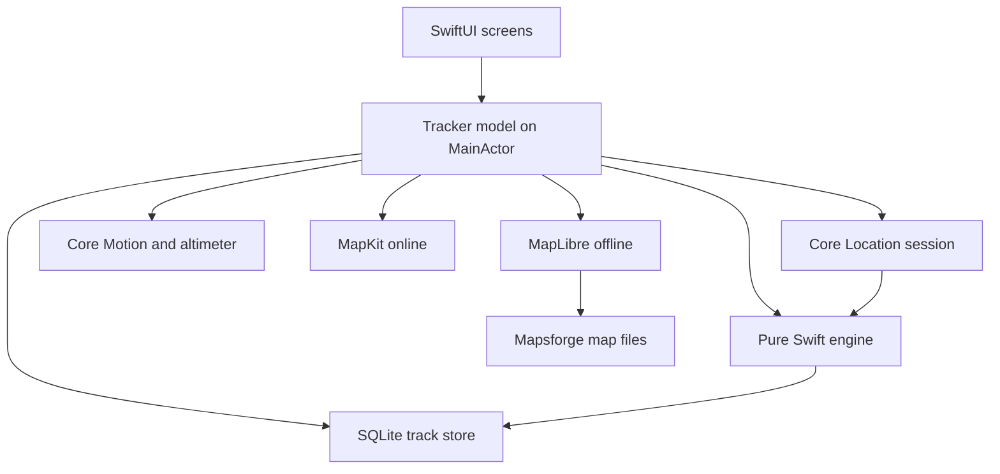
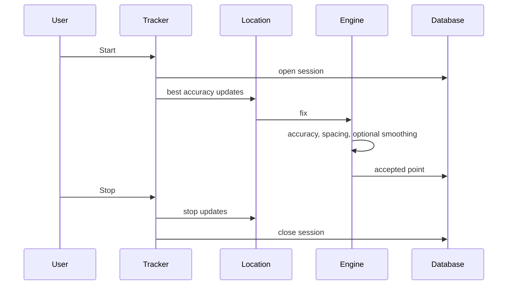

# GPS Track Logger

[Magyar](README-hu.md)

GPS Track Logger records a route on the iPhone and keeps the points in an on-device database. Saved tracks can be shared as GPX 1.1 or KMZ.

The Xcode project is `gtl.xcodeproj`. Sources live in `gtl/`. The shared scheme is `gtl`.

## Requirements

- Xcode with the iOS 17 SDK or newer
- An iPhone simulator, or an iPhone running iOS 17 or newer
- Swift 6

## Version and identity

| | |
| --- | --- |
| Display name | GPS Track Logger |
| Hungarian home-screen name | GTL GPS útvonal napló |
| Bundle identifier | `com.lkovari.mobile.apps.gtl` |
| Version | 2.0.15 |
| Build | 33 |
| Devices | iPhone only, portrait |
| Languages | English and Hungarian, following the system language |
| Appearance | Light and dark, following the system |

Signing is automatic and the development team is unset, so the simulator builds without a paid account. Archive and upload need the Apple Developer Program team selected in Xcode under Signing & Capabilities.

## Build, test, and run

Open `gtl.xcodeproj` and run the `gtl` scheme on an iPhone simulator.

From the command line, using an installed iPhone simulator:

```sh
xcodebuild -project gtl.xcodeproj -scheme gtl \
  -destination 'platform=iOS Simulator,name=iPhone 17' \
  -packageAuthorizationProvider netrc \
  CODE_SIGNING_ALLOWED=NO \
  test
```

If that simulator name is not installed, pick one from:

```sh
xcrun simctl list devices available
```

The unit tests cover recording filters, spacing, smoothing, barometric altitude, exports, and map math. The UI test launches the app, accepts the disclaimer, and checks that the tracker is on screen.

## Architecture



Recording stays off until a session starts. Location, motion, and the barometer run only while that session is open. Heading updates run for the Compass tab, and for the on-map pointer during a session.



## Screens

The first launch shows a disclaimer. Accept is stored on the device. Refuse closes the app.

The tracker has GPS, Route, Map, and Compass. The menu opens Settings, offline map downloads, saved tracks, Help, About, and Location settings. Tapping the version line on About seven times opens the error log.

Settings cover usage (Aircraft, Watercraft, Car, Motorbike, Bicycle, Run/Hike), metric / imperial / ICAO units, appearance, recording density, the barometer when the phone has one, and the layer switches for the map that is in use.

Saved tracks can be shared as GPX or KMZ, shown on the map, or deleted.

## Maps

Online maps use MapKit: standard, satellite, and hybrid, each with realistic elevation. While logging, the camera tilts and turns with the direction of travel. The track is colored by speed. A map tap can request a walking, cycling, or driving route from Apple. Place search on the online map uses MapKit local search.

How to use the camera, the speed colors, KMZ altitude, and a route from a map tap is in [Map features](#map-features) below.

Offline maps use one downloaded region at a time:

- OpenStreetMap regions from `https://download.mapsforge.org/maps/v5/`, with a 2 GB cap and a 64 MB free-space reserve
- Turistautak.hu from `https://turistautak.elte.hu/tuhu/tuhu_mapsforge.zip` only

MapKit cannot draw those files. The app reads the visible tiles from the Mapsforge file and draws them with MapLibre. Decoding runs off the main thread, is cancelled when the camera moves, and does not load a whole country into memory. MapLibre is created only while an offline map is in use.

The map shows OpenStreetMap ODbL attribution, or Turistautak.hu when that map is in use. Hillshade is drawn only when elevation files sit next to the map.

Place search on an offline map uses an on-device index. Queries start at 3 characters and return at most 5 hits.

## Privacy

The privacy manifest declares precise location for app functionality and UserDefaults reason `CA92.1`. The app does not track. `ITSAppUsesNonExemptEncryption` is false.

Purpose strings, in English and Hungarian:

- Location when in use
- Location always and when in use
- Motion

The only background mode is Location. What happens when the screen locks is in [Logging on a locked screen](#logging-on-a-locked-screen).

## A real iPhone

The simulator can show the screens and a simulated GPS location. These need a physical iPhone:

- A continuous track while the screen is locked
- Barometric altitude
- A usable compass heading

## Not available on iPhone

- Ambient temperature. The temperature row says that no sensor is available, and temperature is not stored.
- A separate terrain raster basemap. Realistic elevation is the MapKit terrain, not a hillshade image. Offline maps stay flat.

## Map features

These notes describe the terrain camera, direction-up tracking, speed colors, KMZ altitude, and the route from a map tap. The same steps are on the Help screen, in the language of the phone.

### 3D terrain and a tiltable camera

Apple Maps standard, satellite, and hybrid use realistic elevation. No API key is required. While a session is logging, the camera starts at about 52 degrees of pitch, inside the 45–60 degree range. Two fingers tilt the map, and that pitch is kept on the next follow, clamped between 0 and 65 degrees. Satellite and hybrid then read like a navigation app.

Tap the north dial to put the pitch back to 52 degrees and turn direction-up on again.

Keep whole track on screen stays a flat, north-up view so the whole line fits.

A downloaded OSM or Turistautak map can tilt and follow heading. It has no elevation mesh, so the ground stays flat. Hillshade still appears only when elevation files sit next to that map.

### Direction-up tracking

While logging, the camera heading follows the direction of travel, and the position arrow turns with it. At 1 m/s or faster the GPS course is the direction. Below that, the compass geographic heading is used. A weak compass keeps the last good direction instead of spinning the map. The arrow points up the screen when the camera is direction-up.

The north dial rotates so N still points north.

### Speed-colored track

Each stored point already has a speed. The line uses up to six colors, slow to fast: blue `#3D5AFE`, teal `#1F8A80`, yellow `#F2C14E`, orange `#E07A3D`, carmine `#C13B2E`, deep red `#7A1530`. The dots on the map are the scale for the current usage. A speed below a cut stays in the slower band. The bands are fixed for the current usage, so a new maximum speed does not repaint the line already drawn.

Run:

- blue below 3.6 km/h
- teal 3.6–5.8 km/h
- yellow 5.8–7.9 km/h
- orange 7.9–10.8 km/h
- carmine 10.8–14.4 km/h
- deep red above 14.4 km/h

Hike and walking:

- blue below 3.6 km/h
- teal 3.6–5.8 km/h
- yellow 5.8–7.9 km/h
- orange 7.9–10.8 km/h
- carmine above 10.8 km/h

Bicycle:

- blue below 10.8 km/h
- teal 10.8–21.6 km/h
- yellow 21.6–28.8 km/h
- orange 28.8–39.6 km/h
- carmine 39.6–50 km/h
- deep red above 50 km/h

Car and motorbike:

- blue below 28.8 km/h
- teal 28.8–50.4 km/h
- yellow 50.4–79.2 km/h
- orange 79.2–118.8 km/h
- carmine 118.8–130 km/h
- deep red above 130 km/h

Aircraft:

- blue below 100 km/h
- teal 100–200 km/h
- yellow 200–350 km/h
- orange 350–500 km/h
- carmine 500–600 km/h
- deep red above 600 km/h

Watercraft:

- blue below 7.2 km/h
- teal 7.2–18 km/h
- yellow 18–28.8 km/h
- orange 28.8–43.2 km/h
- carmine above 43.2 km/h

A missing speed uses the slowest color. A saved track uses the same colors. Simplify only thins the drawn line; the kept points keep their speed. The stored route and the GPX or KMZ file still contain every accepted point.

### KMZ with real altitude

GPX already writes GPS altitude in `ele`. KMZ now does the visual half: when any point has a finite GPS altitude, the line and the Google Earth track use `altitudeMode` absolute and that altitude in the coordinate. A point without altitude is written as 0. Start, pause, and stop icons stay clamped to the ground.

If the track has no altitude at all, the line stays clamped to the ground.

Open the KMZ in Google Earth to see the line lifted off the terrain. This is the useful view for a flight or a mountain hike. Google Earth measures absolute altitude from the WGS84 ellipsoid. The phone stores altitude relative to sea level, so the line can sit a few tens of metres above or below the drawn terrain. The file is not converted.

Share from Saved tracks. The file lands in the Files app under On My iPhone → GPS Track Logger → Exports.

### Route to a tapped point

Tap the map, then Route. MapKit draws a walking, cycling, or driving path from your fix to that point. Hike and run use walking, bicycle uses cycling, and car and motorbike use driving. Aircraft and watercraft have no matching road mode, so the card offers Walk, Bicycle, and Car.

The request needs a network. It sends the two coordinates to Apple. The logged track is still stored only on the phone. Without a fix the card says No GPS. Without a path it says No route.

The path is a blue dashed line, separate from the speed-colored track and from the straight-line Distance tool. Tap the route chip to clear it. Starting another route cancels the request that is still running.

### Logging on a locked screen

Start records in the foreground as soon as location is allowed. The track continues after the screen locks only when Location is Always. The blue indicator stays until Stop. If Always is granted during that same Start, background recording turns on immediately. While Using the App, locking the screen stops new points, and a line under the title says so. Settings → Recording → Keep screen on while logging only keeps the display awake. It does not replace Always.

### App Store images

The App Store has no Google Play feature-graphic slot (1024×500). For this iPhone app the required image set is the 6.9-inch screenshot row. The icon ships inside the build and is not uploaded on its own. An iPad set is not required: the target is iPhone only (`TARGETED_DEVICE_FAMILY = 1`). When the 6.9-inch row is present, Apple scales it for 6.5-inch and smaller displays, so those files are optional.

The review note, with file ranges and the fix for each item, is [gtl-ios-review-hu.md](gtl-ios-review-hu.md) (Hungarian).

#### Where each file goes

| File | Size | App Store Connect |
| --- | --- | --- |
| `docs/images/app-store/iphone-6.9-inch/en/01-map.png` through `04-saved-tracks.png` | 1320×2868 PNG, RGB, no alpha | The iOS version → Screenshots → 6.9" Display, English localization. Order: 01, 02, 03, 04. |
| `docs/images/app-store/iphone-6.9-inch/hu/` the same four names | 1320×2868 PNG, RGB, no alpha | The same 6.9" slot, Hungarian localization. |
| `docs/images/app-store/app-icon/app-icon-1024.png` | 1024×1024 PNG, RGB, no alpha, no pre-rounded corners | Not a separate field. The uploaded build supplies the icon. To adopt this file, replace `gtl/Assets.xcassets/AppIcon.appiconset/AppIcon.png`. |

One localization needs 1 to 10 screenshots. This set has four, portrait, because the app is portrait only.

#### What the four images show

1. `01-map.png` — Map while logging, speed-colored line, HUD, north dial.
2. `02-route.png` — Route totals and the elevation line.
3. `03-compass.png` — MAG / TRUE and the rose.
4. `04-saved-tracks.png` — Saved tracks, with Show on map, GPX, KMZ, and Delete.

The English and Hungarian rows are the same four screens. The in-app header stays “GPS Track Logger” in both, matching the code. The Hungarian home-screen name is “GTL GPS útvonal napló”. Start and Stop stay those words in both images, matching the button.

These frames are composed at the 6.9-inch pixel size. Guideline 2.3.3 asks for screenshots of the app in use. Before upload, capture the same four screens on a 6.9-inch iPhone or simulator (1320×2868) if the running UI differs. The saved-tracks image uses readable names (Bicycle, Hike, Car / Kerékpár, Túra, Autó). The list in the app still shows the stored usage code, so do not upload `04-saved-tracks.png` until that label matches.
