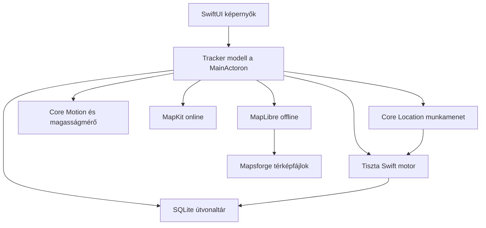
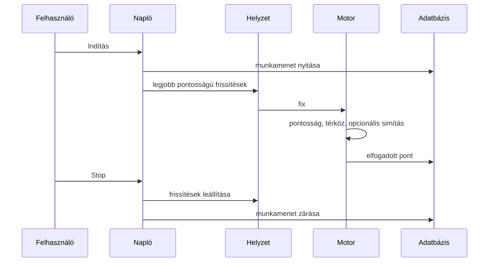

# GPS Track Logger

[English](README-en.md)

A GPS Track Logger útvonalat rögzít az iPhone-on, és a pontokat a készüléken lévő adatbázisban tartja. A mentett útvonalak GPX 1.1 vagy KMZ formában megoszthatók.

Az Xcode-projekt a `gtl.xcodeproj`. A forrás a `gtl/` mappában van. A közös scheme a `gtl`.

## Követelmények

- Xcode az iOS 17 SDK-val vagy újabbal
- iPhone-szimulátor, vagy iOS 17 vagy újabb iPhone
- Swift 6

## Verzió és azonosítók

| | |
| --- | --- |
| Megjelenő név | GPS Track Logger |
| Magyar kezdőképernyő-név | GTL GPS útvonal napló |
| Bundle azonosító | `com.lkovari.mobile.apps.gtl` |
| Verzió | 2.0.15 |
| Build | 33 |
| Készülékek | csak iPhone, álló tájolás |
| Nyelvek | angol és magyar, a rendszer nyelve szerint |
| Megjelenés | világos és sötét, a rendszer szerint |

Az aláírás automatikus, a fejlesztői csapat nincs beállítva, ezért a szimulátor fizetős fiók nélkül is fordul. Az archive és a feltöltés az Apple Developer Program csapatát kéri az Xcode Signing & Capabilities alatt.

## Fordítás, teszt, futtatás

Nyisd meg a `gtl.xcodeproj` fájlt, és futtasd a `gtl` scheme-et egy iPhone-szimulátoron.

Parancssorból, telepített iPhone-szimulátorral:

```sh
xcodebuild -project gtl.xcodeproj -scheme gtl \
  -destination 'platform=iOS Simulator,name=iPhone 17' \
  -packageAuthorizationProvider netrc \
  CODE_SIGNING_ALLOWED=NO \
  test
```

Ha ez a szimulátornév nincs telepítve, válassz egyet innen:

```sh
xcrun simctl list devices available
```

A unit tesztek a rögzítési szűrőket, a térközt, a simítást, a barometrikus magasságot, az exportot és a térképszámítást fedik. A UI-teszt elindítja az appot, elfogadja a nyilatkozatot, és ellenőrzi, hogy a napló a képernyőn van.

## Felépítés



A rögzítés addig áll, amíg egy munkamenet el nem indul. A helyzet, a mozgás és a barométer csak nyitott munkamenet alatt fut. Az iránymérés az Iránytű fülhöz, és munkamenet közben a térképen lévő mutatóhoz megy.



## Képernyők

Az első indítás nyilatkozatot mutat. Az elfogadás a készüléken tárolódik. Az elutasítás bezárja az appot.

A naplónak GPS, Útvonal, Térkép és Iránytű füle van. A menü a Beállításokat, az offline térképletöltést, a mentett útvonalakat, a Súgót, a Névjegyet és a Helyzet beállításait nyitja. A Névjegy verziósorára hétszer koppintva megnyílik a hibanapló.

A beállítások: használat (Repülő, Hajó, Autó, Motor, Kerékpár, Futás/Túra), metrikus / angolszász / ICAO mértékegység, megjelenés, rögzítési sűrűség, barométer ha a telefonon van, és a használt térkép rétegkapcsolói.

A mentett útvonalak megoszthatók GPX-ként vagy KMZ-ként, megjeleníthetők a térképen, vagy törölhetők.

## Térképek

Az online térkép MapKit: standard, műhold és hibrid, mindegyik valós domborzattal. Naplózás közben a kamera a haladás irányával dől és fordul. A nyomvonal sebesség szerint színezett. A térkép koppintása gyalogos, kerékpáros vagy autós útvonalat kérhet az Apple-től. A helykeresés az online térképen a MapKit helyi keresését használja.

A kamera, a sebességszín, a KMZ-magasság és a koppintott pontig vezető út a lenti [Térkép funkciók](#térkép-funkciók) részben van.

Offline térkép egyszerre egy letöltött régió:

- OpenStreetMap régiók a `https://download.mapsforge.org/maps/v5/` címről, 2 GB-os plafonnal és 64 MB szabadhely-tartalékkal
- Turistautak.hu csak a `https://turistautak.elte.hu/tuhu/tuhu_mapsforge.zip` címről

A MapKit ezeket a fájlokat nem rajzolja. Az app a látható csempéket olvassa a Mapsforge fájlból, és MapLibre-rel rajzolja. A dekódolás a fő szálon kívül fut, a kamera mozdulásakor megszakad, és nem tölti be az egész országot a memóriába. A MapLibre csak addig jön létre, amíg offline térkép van használatban.

A térkép OpenStreetMap ODbL forrásmegjelölést mutat, vagy Turistautak.hu-t, ha az a térkép van használatban. Domborzatárnyékolás csak akkor van, ha magasságfájlok ülnek a térkép mellett.

Az offline térkép helykeresése készüléken lévő indexet használ. A keresés 3 karakternél indul, és legfeljebb 5 találatot ad.

## Adatvédelem

A privacy manifest pontos helyet kér az app működéséhez, és a UserDefaults oka `CA92.1`. Az app nem követ. Az `ITSAppUsesNonExemptEncryption` hamis.

A cél-szövegek angolul és magyarul:

- Helyzet az app használata közben
- Helyzet mindig és használat közben
- Mozgás

Az egyetlen háttérmód a Helyzet. A zárolt képernyő viselkedése a [Rögzítés zárolt képernyőn](#rögzítés-zárolt-képernyőn) részben van.

## Valódi iPhone

A szimulátor megmutatja a képernyőket és egy szimulált GPS-helyzetet. Ezekhez fizikai iPhone kell:

- Folyamatos nyomvonal zárolt képernyőn
- Barometrikus magasság
- Használható iránytűállás

## Ami az iPhone-on nincs

- Környezeti hőmérséklet. A hőmérséklet sora azt írja, hogy nincs érzékelő, és a hőmérséklet nem tárolódik.
- Külön domborzati raszter alaptérkép. A valós domborzat a MapKit terepe, nem domborzatárnyékoló kép. Az offline térkép lapos marad.

## Térkép funkciók

Ezek a jegyzetek a domborzatos kamerát, a menetirányú követést, a sebességszínt, a KMZ magasságot és a koppintott pontig vezető útvonalat írják le. Ugyanezek a lépések a Súgóban is ott vannak, a telefon nyelvén.

### 3D domborzat és dönthető kamera

Az Apple térkép standard, műhold és hibrid stílusa valós domborzatot használ. API-kulcs nem kell. Rögzítés közben a kamera kb. 52 fokos dőléssel indul, a 45–60 fokos tartományban. Két ujjal dönthető a térkép, és a következő követés ezt a dőlést tartja meg, 0 és 65 fok között. A műhold és a hibrid így navigációs appnak látszik.

Az észak-tárcsa koppintása visszaállítja az 52 fokot, és újra bekapcsolja a menetirányt.

A teljes track a képen felülnézet marad, észak felé, hogy a vonal beférjen.

A letöltött OSM vagy Turistautak térkép dönthető és követi az irányt. Nincs domborzat-hálója, a talaj lapos marad. Domborzatárnyékolás csak akkor van, ha magasságfájlok ülnek a térkép mellett.

### Menetirányú követés

Rögzítés közben a kamera a haladási iránnyal fordul, és a pozíció nyila is vele. 1 m/s-tól a GPS course az irány. Alatta az iránytű földrajzi iránya. Gyenge iránytűnél az utolsó jó irány marad, a térkép nem pörög. Menetirányú kameránál a nyíl a képernyő teteje felé mutat.

Az észak-tárcsa elfordul, így az N továbbra is északra mutat.

### Sebesség szerint színezett nyomvonal

Minden tárolt pontnak van sebessége. A vonal legfeljebb hat színt használ, lassútól gyorsig: kék `#3D5AFE`, türkiz `#1F8A80`, sárga `#F2C14E`, narancs `#E07A3D`, kármin `#C13B2E`, mélyvörös `#7A1530`. A térkép pöttyei az aktuális használat skálája. A határ alatti sebesség az alacsonyabb sáv. A sávok a használathoz vannak kötve, ezért egy új maximum nem festi újra a már megrajzolt vonalat.

Futás:

- kék 3,6 km/h alatt
- türkiz 3,6–5,8 km/h
- sárga 5,8–7,9 km/h
- narancs 7,9–10,8 km/h
- kármin 10,8–14,4 km/h
- mélyvörös 14,4 km/h fölött

Túra és gyaloglás:

- kék 3,6 km/h alatt
- türkiz 3,6–5,8 km/h
- sárga 5,8–7,9 km/h
- narancs 7,9–10,8 km/h
- kármin 10,8 km/h fölött

Kerékpár:

- kék 10,8 km/h alatt
- türkiz 10,8–21,6 km/h
- sárga 21,6–28,8 km/h
- narancs 28,8–39,6 km/h
- kármin 39,6–50 km/h
- mélyvörös 50 km/h fölött

Autó és motor:

- kék 28,8 km/h alatt
- türkiz 28,8–50,4 km/h
- sárga 50,4–79,2 km/h
- narancs 79,2–118,8 km/h
- kármin 118,8–130 km/h
- mélyvörös 130 km/h fölött

Repülő:

- kék 100 km/h alatt
- türkiz 100–200 km/h
- sárga 200–350 km/h
- narancs 350–500 km/h
- kármin 500–600 km/h
- mélyvörös 600 km/h fölött

Hajó:

- kék 7,2 km/h alatt
- türkiz 7,2–18 km/h
- sárga 18–28,8 km/h
- narancs 28,8–43,2 km/h
- kármin 43,2 km/h fölött

A hiányzó sebesség a leglassabb szín. A mentett útvonal ugyanezeket a színeket kapja. Az egyszerűsítés csak a rajzolt vonalat ritkítja; a megtartott pontok sebessége megmarad. A tárolt útvonal és a GPX vagy KMZ fájl továbbra is minden elfogadott pontot tartalmaz.

### KMZ valódi magassággal

A GPX a GPS-magasságot már az `ele` mezőbe írja. A KMZ most a vizuális felét is megcsinálja: ha bármely pontnak van véges GPS-magassága, a vonal és a Google Earth track `altitudeMode` absolute, és a koordinátában ez a magasság van. A magasság nélküli pont 0. Az indulás, szünet és megállás ikon a talajon marad.

Ha egyáltalán nincs magasság, a vonal a talajra simul.

A KMZ-t a Google Earthben megnyitva a vonal kiemelkedik a terepből. Repülésnél és hegyi túránál ez a látványos nézet. A Google Earth az absolute magasságot a WGS84 ellipszoidtól méri. A telefon tengerszinthez képesti magasságot tárol, ezért a vonal néhány tíz méterrel a rajzolt terep fölött vagy alatt ülhet. A fájl nincs átváltva.

Megosztás a Mentett útvonalakból. A fájl a Fájlok appban van: A(z) iPhone-omon → GPS Track Logger → Exports.

### Útvonal a koppintott pontig

Koppints a térképre, majd az Útvonalra. A MapKit gyalog, kerékpárral vagy autóval rajzol utat a saját fixtől addig a pontig. A túra és a futás gyalog, a kerékpár kerékpárral, az autó és a motor autóval megy. A repülőnek és a hajónak nincs illő úthálózata, ezért a kártya Gyalog, Kerékpár és Autó sort ad.

A kéréshez hálózat kell. A két koordinátát elküldi az Apple-nek. A naplózott track továbbra is csak a telefonon van. Fix nélkül a kártya azt írja: Nincs GPS. Út nélkül: Nincs útvonal.

Az út kék szaggatott vonal, külön a sebesség szerint színezett tracktől és a légvonalas Távolságtól. Az útvonal chipje törli. Új útvonal kérés megszakítja a még futó kérést.

### Rögzítés zárolt képernyőn

Az Indítás az előtérben rögzít, amint a hely engedélyezett. Zárolt képernyőn a nyomvonal csak akkor megy tovább, ha a Helyzet Mindig. A kék jelző a Stopig látszik. Ha a Mindig ugyanazon az Indításon jön meg, a háttérrögzítés azonnal bekapcsol. Az app használata közben a zárolás megállítja az új pontokat, és a cím alatt egy sor ezt kiírja. Beállítások → Rögzítés → Képernyő bekapcsolva naplózás közben csak a kijelzőt tartja ébren. Nem helyettesíti a Mindig engedélyt.

### App Store képek

Az App Store-nak nincs Google Play-s feature graphic helye (1024×500). Ennél az iPhone-alkalmazásnál a kötelező kép a 6,9 hüvelykes képernyőkép-sor. Az ikon a buildből jön, külön nem töltődik fel. iPad-készlet nem kell: a target csak iPhone (`TARGETED_DEVICE_FAMILY = 1`). Ha a 6,9 hüvelykes sor megvan, a 6,5 hüvelykes és a kisebb méretek az Apple skálázásával mennek, külön fájl nem kötelező.

A review jegyzet, sorokkal és javítással: [gtl-ios-review-hu.md](gtl-ios-review-hu.md).

#### Hova kerülnek

| Fájl | Méret | App Store Connect |
| --- | --- | --- |
| `docs/images/app-store/iphone-6.9-inch/en/01-map.png` … `04-saved-tracks.png` | 1320×2868 PNG, RGB, alfa nélkül | Az app iOS verziója → Screenshots → 6.9" Display, angol lokalizáció. Sorrend: 01, 02, 03, 04. |
| `docs/images/app-store/iphone-6.9-inch/hu/` ugyanaz a négy név | 1320×2868 PNG, RGB, alfa nélkül | Ugyanaz a 6.9" hely, magyar lokalizáció. |
| `docs/images/app-store/app-icon/app-icon-1024.png` | 1024×1024 PNG, RGB, alfa nélkül, sarok nélkül | Nem külön mező. Az ikont a feltöltött build adja. Csere: a fájl menjen a `gtl/Assets.xcassets/AppIcon.appiconset/AppIcon.png` helyére. |

Egy lokalizációhoz 1–10 képernyőkép kell. Itt négy van, állóban, mert az app csak álló tájolást enged.

#### Mit mutat a négy kép

1. `01-map.png` — Térkép, naplózás, sebesség szerint színezett vonal, HUD, észak-tárcsa.
2. `02-route.png` — Útvonal összesítő és magassági vonal.
3. `03-compass.png` — MAG / TRUE és a számlap.
4. `04-saved-tracks.png` — Mentett útvonalak, Térképen, GPX, KMZ, Törlés.

Az angol és a magyar sor ugyanazt a négy képernyőt mondja, a felirat a nyelv. A kezdőképernyő neve magyarul „GTL GPS útvonal napló”; a képen a fejléc a kóddal együtt „GPS Track Logger”. A Start és a Stop a jelenlegi gomb felirata, mindkét nyelven.

Ezek összeállított képek, a 6,9 hüvelykes méretre. A 2.3.3 szerint a feltöltött kép a futó appot mutassa. Feltöltés előtt ugyanaz a négy képernyő jöjjön egy 6,9 hüvelykes iPhone-ról vagy szimulátorról (1320×2868), ha a futó felület eltér. A mentett útvonal képe olvasható nevet mutat (Kerékpár, Túra, Autó). A lista a kódban még a tárolt nyers típust írja; amíg ez így van, a `04-saved-tracks.png` ne menjen fel.
