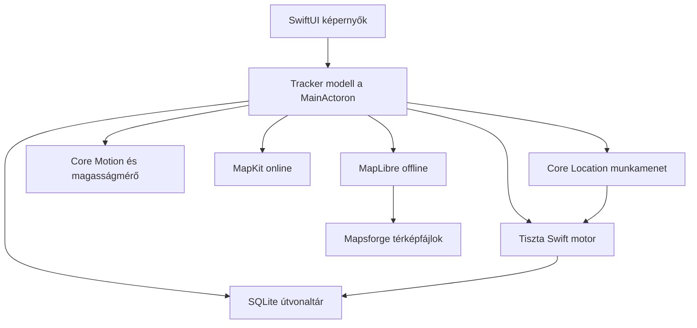
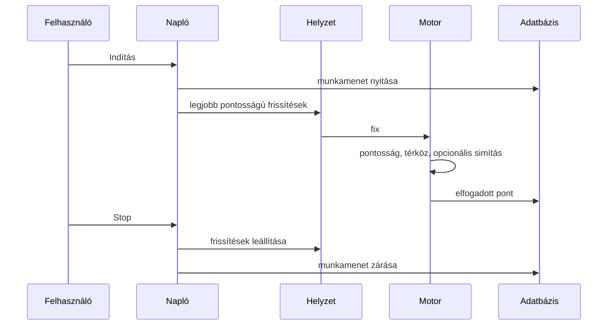

# GPS Track Logger

[English](README-en.md)

A GPS Track Logger útvonalat rögzít az iPhone-on, és a pontokat a készüléken lévő adatbázisban tartja. A mentett útvonalak GPX 1.1 vagy KMZ formában megoszthatók.

Az Xcode-projekt a `gtl.xcodeproj`. A forrás a `gtl/` mappában van. A közös scheme a `gtl`.

## Követelmények

- Xcode az iOS 17 SDK-val vagy újabbal
- iPhone-szimulátor, vagy iOS 17 vagy újabb iPhone
- Swift 6

## Verzió és azonosítók

| | |
| --- | --- |
| Megjelenő név | GPS Track Logger |
| Magyar kezdőképernyő-név | GTL GPS útvonal napló |
| Bundle azonosító | `com.lkovari.mobile.apps.gtl` |
| Verzió | 1.0.1 |
| Build | 33 |
| Készülékek | csak iPhone, álló tájolás |
| Nyelvek | angol és magyar, a rendszer nyelve szerint |
| Megjelenés | világos és sötét, a rendszer szerint |

Az aláírás automatikus, a fejlesztői csapat nincs beállítva, ezért a szimulátor fizetős fiók nélkül is fordul. Az archive és a feltöltés az Apple Developer Program csapatát kéri az Xcode Signing & Capabilities alatt.

## Fordítás, teszt, futtatás

Nyisd meg a `gtl.xcodeproj` fájlt, és futtasd a `gtl` scheme-et egy iPhone-szimulátoron.

Parancssorból, telepített iPhone-szimulátorral:

```sh
xcodebuild -project gtl.xcodeproj -scheme gtl \
  -destination 'platform=iOS Simulator,name=iPhone 17' \
  -packageAuthorizationProvider netrc \
  CODE_SIGNING_ALLOWED=NO \
  test
```

Ha ez a szimulátornév nincs telepítve, válassz egyet innen:

```sh
xcrun simctl list devices available
```

A unit tesztek a rögzítési szűrőket, a térközt, a simítást, a barometrikus magasságot, az exportot és a térképszámítást fedik. A UI-teszt elindítja az appot, elfogadja a nyilatkozatot, és ellenőrzi, hogy a napló a képernyőn van.

## Felépítés



A rögzítés addig áll, amíg egy munkamenet el nem indul. A helyzet, a mozgás és a barométer csak nyitott munkamenet alatt fut. Az iránymérés az Iránytű fülhöz, és munkamenet közben a térképen lévő mutatóhoz megy.



## Képernyők

Az első indítás nyilatkozatot mutat. Az elfogadás a készüléken tárolódik. Az elutasítás bezárja az appot.

A naplónak GPS, Útvonal, Térkép és Iránytű füle van. A menü a Beállításokat, az offline térképletöltést, a mentett útvonalakat, a Súgót, a Névjegyet és a Helyzet beállításait nyitja. A Névjegy Hibanapló gombja megnyitja a hibanaplót. A Mentett útvonalakban a Rögzített pontok egy kijelölt útvonal tárolt pontjait mutatja.

A GPS és az Útvonal ugyanazt a műszernyelvet használja, mint az iránytű. A világos és a sötét mód a rendszert követi, ugyanazon a háttéren, mint a többi fül. Az adatok nem változtak. A képernyőn elfoglalt helyük változott.

### GPS

A GPS fül helyzetlemez.

Felül egy pont és egy mondat. A naplózás világos módban türkiz, sötétben cián. Gyenge GPS naplózás közben borostyánsárga. Kikapcsolt helyzet, vagy ha a Pontos hely kell, kármin, ugyanaz a szín, mint az iránytű északja. Az üresjárat és a fixre várakozás a másodlagos szín. A mondat egy ezek közül: Logging, GPS quality is too low, Location is off, Precise location is required, Waiting for GPS, Idle. Magyarul: Naplózás, A GPS minősége túl alacsony, A helyzet ki van kapcsolva, Pontos hely kell, Várakozás a GPS-re, Üresjárat.

Ha a helyzet denied vagy restricted, vagy a Pontos hely még kell, a magyarázat és egy kármin Helyzet beállítások gomb a mondat alatt van. A gomb a meglévő Helyzet beállítások képernyőt nyitja.

A szélesség és a hosszúság a nagy szám, hat tizedes, fokjellel. Az észak kármin. A dél, a kelet és a nyugat az elsődleges szövegszín. Fix nélkül a sor gondolatjel, a félteke betűje rejtve van.

A pontosság a következő szám, méterben. 15 m-ig türkiz, sötét módban cián. Onnantól 40 m-ig az elsődleges szövegszín. 40 m fölött borostyánsárga. Pontosság nélkül gondolatjel.

Egy hajszálvonal választja el a lemezt a kétoszlopos olvasótól. Az érték a neve fölött van. A párok: GPS magasság és baro, ellipszoid és nyomás, függőleges pontosság és a fix kora. A fix kora másodpercenként frissül. A hiányzó érték gondolatjel. Ha a fixfelhő be van kapcsolva, az n, az RMS és a CEP95 egy sorban követi.

### Útvonal

Az Útvonal fül útszámláló. A sebesség a számlap: nagy, kerekített szám, alatta a Beállítások mértékegysége. Naplózás közben a szám az elsődleges szövegszín, a mértékegység türkiz, sötét módban cián. Üresjáratban mindkettő másodlagos, és a sebesség 0. Az alatta lévő átlag ugyanebben az esetben 0.

Egy hajszálvonal alatt az eltelt idő és a számláló a mozgásban töltött idő és a várakozás mellett áll, függőleges vonallal elválasztva. Újabb hajszálvonal, aztán a magasság, az irány és a dőlés egy sorban. A környezet továbbra is „No sensor”, magyarul „Nincs érzékelő”. Ezen a telefonon nincs hőmérséklet-szenzor, és ez a sor halkabb a többinél.

A magassági profil csak akkor jelenik meg, ha két pontnak van GPS-magassága. Kármin vonal, alatta halvány kitöltés, az utolsó ponton egy pötty. A rajz alsó és felső magassága bal oldalon van. Két halvány vízszintes vezető és egy alapvonal ül a vonal mögött. Ha van nyomásminta, szaggatott türkiz vonal, sötét módban cián, a barometrikus magasság, és egy rövid jelmagyarázat nevezi meg a GPS magasságot és a Barót. A két magasság nélkül a profil nem rajzolódik, üres diagram nem tölti ki a képernyőt.

A Beállítások úgy épül fel, mint a Névjegy és a Súgó. A felső kártya mindig látszik: a Használati mód hat ikonnal és névvel (Repülő, Hajó, Autó, Motor, Kerékpár, Futás/Túra), a kiválasztott magentával, alatta a Mértékegység három gombbal (Metric, Imperial, ICAO). A kártya alatt minden csoportnak címsora van, ami koppintásra lenyílik, és egyszerre több is nyitva lehet: Megjelenés, Rögzítés a rögzítési sűrűséggel, Barométer, ha a telefonon van, és Adatvédelmi nyilatkozat. Az OpenStreetMap vagy a Turistautak.hu rétegkapcsolói külön csoportot alkotnak, ami csak akkor látszik, ha a Letöltött térkép be van kapcsolva.

A mentett útvonalak megoszthatók GPX-ként vagy KMZ-ként, megjeleníthetők a térképen, vagy törölhetők.

## Térképek

Az online térkép MapKit: standard, műhold és hibrid, mindegyik valós domborzattal. Naplózás közben a kamera a haladás irányával dől és fordul. A nyomvonal sebesség szerint színezett. A térkép koppintása gyalogos, kerékpáros vagy autós útvonalat kérhet az Apple-től. A helykeresés az online térképen a MapKit helyi keresését használja.

A kamera, a sebességszín, a KMZ-magasság és a koppintott pontig vezető út a lenti [Térkép funkciók](#térkép-funkciók) részben van.

Offline térkép egyszerre egy letöltött régió:

- OpenStreetMap régiók a `https://ftp-stud.hs-esslingen.de/Mirrors/download.mapsforge.org/maps/v5/` HTTPS-tükörről, kontinensek szerint csoportosítva, 5 GiB-os plafonnal és 64 MB szabadhely-tartalékkal
- Turistautak.hu csak a `https://turistautak.elte.hu/tuhu/tuhu_mapsforge.zip` címről

A letöltés előbb a fájl tényleges méretét olvassa. Ha a méret nem olvasható, nagyobb a plafonnál, vagy a szabad hely a 64 MB tartalékkal nem elég, a letöltés nem indul. Mobilhálózaton a méret megerősítés után indul. Menet közben a letöltés megáll, ha a leírt bájt átlépné a szabad helyet a tartalékkal, vagy a plafont. A letöltött térképfájl kimarad a készülék mentéséből.

A MapKit ezeket a fájlokat nem rajzolja. Az app a látható csempéket olvassa a Mapsforge fájlból, és MapLibre Native-nel rajzolja (BSD 2-Clause). A dekódolás a fő szálon kívül fut, és a kamera mozdulásakor megszakad. A memóriában legfeljebb 48 csempe és 64 MB dekódolt térkép lehet, a kamera mögötti csempék kiesnek, ezért egy hosszú út ugyanannyi térképmemóriát használ, mint egy rövid. A térképfájl a lemezen marad. Ha a képernyő zárol, másik fül van kiválasztva, vagy az appváltó nyílik, ezek a csempék és a nyitott fájl kikerülnek. Visszatéréskor csak az aktuális ablak töltődik. A helynévindex kötegenként készül, amíg nincs rögzítés és a térkép látszik, utána a fájl bezárul. A MapLibre csak addig jön létre, amíg offline térkép van használatban. A névjegy a MapLibre copyright sorait is kiírja.

Nagyításkor egy Mapsforge csempe nagyobb, mint a telefon képernyője. A csempe azonosítója a fájl alap-nagyítása, nem a képernyő nagyítása. A vonalak nagyítási sorokban vannak. A magyar fájlban az utcahálózat az első sorban van (z12), a gyalogutak z13-ban, a szervizutak z14-ben, a házak z15-ben. Egy soron belül a vonalak nem földrajzi sorrendben állnak. A fájl elejéről megtartott néhány száz vonal ezért egy sarokba eshet. Ezt látta a térkép szaggatott vonaldarabként, üres téglalapként, vagy úgy, hogy csak egy sáv rajzolódott ki a képernyő alján, a helyzetjelző pedig üres területen ült.

A dekódolás minden nagyításon a képernyőre eső vonalakat tartja meg, a képernyő körül nagyjából fél képernyőnyi ráhagyással. A vonal 16 bites alcsempe-bitképe a csempe 4×4-es rácsa, két nagyítási szinttel lejjebb. Ha egy bit sem esik a nézetre, a vonal koordinátái kimaradnak. A partvonal minden bitje be van állítva, az megmarad. A megtartott vonalakból az út, a vasút és a vízfolyás kapja a keret körülbelül 60 százalékát, a föld- és vízfelület 20 százalékát, a többi a házaké és az egyéb vonalaké. Az útkeretből már semmi nincs fenntartva a képernyő saját sorának, mert az utcák a durvább sorokban vannak.

A fájlból kért nagyítási sor a MapLibre nagyítása plusz egy. A MapLibre 512 pontos csempével számol, a 14-es nagyítása a hagyományos 15-ös léptékét mutatja, a Mapsforge sorai pedig a hagyományos léptékhez készültek.

A közeli nézetben (12-es és nagyobb fájlnagyítás, az alap 14-es alfájlból) a csempénkénti plafon 4000, ha egy vagy két csempe fedi a nézetet, hatig 2500, afölött 1200. A 4 MB-nál nagyobb csempe nem kerül be egészben.

Az áttekintés (11-es és kisebb fájlnagyítás, vagy bármely nézet, amely az alap 5-ös vagy alap 10-es alfájlra esik vissza) már nem sorszám szerint tartja meg minden nyolcadik vonalat. A képernyő nagyításáig minden sor minden vonalát beolvassa, megtartja a képernyőre esőket, és eldobja, amit a térkép nem rajzol. Összesen legfeljebb 12 000 alakzat marad. Ha egy csempében több van a részénél, a sorrend: autópálya, autóút és az országhatár, utána főút, víz, másodrendű út, harmadrendű út és vasút, csomóponti ágak, földfelület méret szerint, végül a többi út. Az országhatár (`admin_level=2`) külön vonalat kapott.

Egy már beolvasott csempe akkor készül újra, ha a képernyő nagyítása nagyobb, mint amihez dekódolva lett, vagy a csempének a most látható része kilóg a korábban lefedett területből. A ráhagyáson belüli kis mozgatás nem indít új dekódolást. A képernyő közepéhez legközelebbi csempe akkor is bent marad, ha a menetirányban előre néző, nagyobb csempék egyébként kitöltenék a 64 MB-os keretet. A csempék egyenként, a fő szálon kívül készülnek. A kamera mozdulata új munkát indít, de az éppen dekódolt csempe elkészül és megmarad. A térkép a csempék érkezésével frissül, legfeljebb 0,4 másodpercenként, és a végén még egyszer. A GeoJSON forrás a helyén cserélődik, előtte nem ürül ki, és a MapLibre saját csempegyorstára bekapcsolva marad. A kiürítés és a gyorstár kikapcsolása üres térképet hagyott, a tartós memóriát nem csökkentette: az a nyitott térkép GPU-felülete és a MapLibre szálai. Az Instruments több gigabájtos összesenje a már felszabadított foglalásokat is számolja.

A hiba és az egyes lépések leírása: `osm-rendering-problem-hu.md`.

Négy későbbi javítás ugyanebben a dekódolóban, a mérésekkel együtt a `rendering-fix-hu.md` fájlban:

- **Rács a csempék határán.** A Mapsforge-író minden csempébe betesz egy `natural=sea` és egy `natural=nosea` téglalapot, ami a csempét lefedi. Ezek a tengerpart rajzolásához kellenek. Az olvasó nem ismerte őket, és minden ismeretlen vonalat útnak vett, ezért a téglalapok fehér útként rajzolódtak a csempe szélére. Nagyítás és kicsinyítés közben ez rácsnak látszott, országos nézetben nagy téglalapoknak. Az olvasó most eldobja ezt a két téglalapot. Útként csak az rajzolódik, aminek `highway` címkéje van, és a vasút. Kerítés, vezeték, határ és parkoló körvonala nem.
- **A rögzítés megállt lezárt képernyőnél, offline térképpel.** A helynévindex a háttérben is tovább dolgozott, mert a megszakítást csak két csempe között nézte, és egy nagy csempe fél percnél tovább tart. Az iOS a háttérben 60 másodpercre 80 százalék processzort enged. A telefon naplója szerint az index 98 százalékon futott, és a rögzítés a túllépés másodpercében állt meg. A folyamat életben maradt, a memória nem fogyott el. MapKit térképpel az index nem indul, ott nem volt szünet. A megszakítás most a vonalak és a helyek ciklusán belül is érvényesül, 256 elemenként, az indexben és a csempedekódolásban is.
- **Fölösleges foglalás vonalanként.** Az olvasó minden vonalnál összefűzte a fájl összes útcímkéjét (a magyar fájlban 339 címke, 5,6 KB), hogy eldöntse, turistatérkép-e. Ez adta az Instrumentsben mért forgalom közel felét. A jelző most egyszer, a fejléc beolvasásakor számolódik.
- **Változó értékű címkék.** A Mapsforge-ben előbb jön a vonal összes címke-azonosítója, utánuk az értékek (`building:levels`, `height`, `roof:colour`). Az olvasó az értéket rögtön az azonosító után olvasta. Ha a változó címke nem az utolsó volt, a többi címke, a név és a geometria elcsúszott. A kimért csempékben a vonalak 0,4 százalékát érintette, szinte mind házat.

Három további javítás jött, miután kicsinyített nézetben szétszórt útdarabok, a földfelületben egy üres téglalap, és egy percig hibásan maradt kép látszott:

- **Áttekintő mintavétel.** A 12-es fájlnagyítás alatt az olvasó sorszám szerint a csempe minden nyolcadik vonalát tartotta meg, típustól függetlenül. Országos nézetben ebből autópálya-morzsák lettek, és amelyik földfelület-darab nem esett a mintába, annak a helyén éles szélű lyuk maradt. Ugyanazt a nézetet a valódi fájlon lejátszva a lyukban 11-es nagyításon 6 út volt, 12-esen 156. Az áttekintés most a képernyőre szűr és osztály szerint rangsorol, ahogy fent áll.
- **Egy szinttel elcsúszott nagyítás.** Az olvasó a MapLibre nagyítását kapta. A 14-es nyitó nagyításon a házak sora (z15) nem volt kérve, pedig a lépték már 15-ös volt.
- **Kicsinyítve csak egy kereszt alakú folt rajzolódott ki.** Egy nézet több csempét kérhetett, mint amennyit a gyorsítótár tartott (24). Az olvasó ilyenkor a 24 legközelebbit tartotta meg, a képernyő többi része üres maradt, ebből lett a közép körüli rombusz. A plafon most 48 csempe, és ha egy nézetnek ennél több kell, az olvasó mindig a következő durvább alfájlra vált, így a teljes képernyő le van fedve. A legtágabb nézetekben ez csak autópályát, autóutat és országhatárt jelent.
- **Elveszett kész csempék.** A kamera mozdulata megszakította a futó dekódolást, és eldobta az eredményét. A félbeszakadt menet által eltárolt csempék pedig soha nem kerültek a térképre, ha a következő hívás már nem talált hiányzót. A nagyítás gombjának többszöri megnyomása mindkettőt előhozta. Az éppen dekódolt csempe most elkészül és megmarad, és ami el van tárolva, de még nem látszik, az a következő hívásnál kikerül a térképre.

Az útkeret is változott: a háromnegyede a képernyő nagyítási sorának volt fenntartva, amiben 16-os nagyításon csak lépcsők vannak. A durvább sorok utcái csempénként 300-at kaphattak. Ez a fenntartás megszűnt.

Ami még nyitva van: az olvasó vonalanként címkeszótárat épít, és lassabb a kelleténél, a nyomvonal pedig minden fixnél újraépül. Ez a `rendering-fix-hu.md` 2. és 6. pontja. Hosszú úton egyik javítás sincs még kipróbálva.

Offline OSM térképnél a sarokfelirat `© OpenStreetMap contributors`. Turistautak térképnél `© Turistautak.hu`, a névjegy a lapra és a jogi nyilatkozatra hivatkozik. Domborzatárnyékolás csak akkor van, ha magasságfájlok ülnek a térkép mellett.

Az offline térkép helykeresése készüléken lévő indexet használ. Az index rögzítés közben nem készül. A keresés 3 karakternél indul, és legfeljebb 5 találatot ad.

## Adatvédelem

A privacy manifest nem deklarál gyűjtött adatot: a nyomvonal a telefonon marad, a MapKit-kéréseket az Apple szolgálja ki, nem a fejlesztő. Az App Store Connect válasz Data Not Collected. A required reason API okok: UserDefaults `CA92.1`, fájlidő `C617.1`, lemezhely `E174.1`. Az app nem követ. Az `ITSAppUsesNonExemptEncryption` hamis.

A naplózott nyomvonal, a gyorsulás és a dőlés a telefon SQLite adatbázisában marad. Az iPhone mentése ezt az adatbázist tartalmazza. A letöltött térképfájl a mentésből ki van zárva. A térkép, a keresés, az útvonal és a cím az Apple-nek küldi az ehhez szükséges koordinátát vagy térképablakot. Az OSM- és a Turistautak-letöltésnél a kiszolgáló látja az IP-címet és a kért fájlt. Letöltött térképen a helykeresés a telefonon fut. A hibanapló a telefonon marad, és sehova nem kerül elküldésre. A naplózott track nem kerül a fejlesztő szerverére. Ezt mondja az első képernyő és a Súgó használati bekezdése is.

Az adatvédelmi nyilatkozat: `https://lkovari.github.io/KLHome/assets/bigfiles/gtl-ios-private-policy.html`. Ugyanez az App Store Connect Support URL. A forrás a `docs/gtl-ios-private-policy.html` fájl; a lapot a feltöltés előtt a KLHome oldalra kell másolni. A névjegyben a `laszlo.kovary@gmail.com` cím is ott van. A link az első képernyőn, a Beállításokban és a Súgóban is elérhető.

Az első képernyő Elutasítom gombja nem lép ki. A rögzítés az Elfogadomig nem indul. A GTL csak „Az app használata közben” engedélyt kér, Mindig engedélyt soha. Az Indítás után a rögzítés zárolt képernyőn és háttérben is folytatódik a Leállításig. Csökkentett pontosságnál a rögzítés a Pontos hely nélkül nem indul. Elutasított helyengedélynél vagy kikapcsolt Pontos helynél az Indítás és a helyzetgomb bármelyik fülön figyelmeztetést ad Beállítások megnyitása gombbal; a GPS fül is elmagyarázza.

A cél-szövegek angolul és magyarul:

- Helyzet az app használata közben
- Mozgás
- Ideiglenes pontos hely a nyomvonalhoz (`PreciseRoute`)

Az egyetlen háttérmód a Helyzet. A zárolt képernyő viselkedése a [Rögzítés zárolt képernyőn](#rögzítés-zárolt-képernyőn) részben van.

## Ami a korábbi viselkedéshez képest változott

Ezek a változások az App Store review miatt kerültek be. A rögzítés, a térkép, a mentett útvonal és az export megmaradt. Néhány művelet, ami régen azonnal lefutott, most egy ellenőrzésen vagy egy választáson megy át. Ahol a feltétel megvan, a művelet ugyanúgy folytatódik.

### Elutasítom

Régen az első képernyő Elutasítom gombja `exit(0)` hívással megszakította az alkalmazás folyamatát. Az iOS-en a felületen nincs Kilépés: a folyamatot a rendszer zárja be. A review ezt kész, használható app és tervezés alatt szokta visszaküldeni.

Most a gomb a nyilatkozat képernyőn hagy. Megjelenik a mondat, hogy a rögzítés addig nem indul, amíg a felhasználó el nem fogadja. Az Elfogadom továbbra is a `disclaimer` UserDefaults kulcsot írja, és utána a nyomkövető nyílik meg.

### Nyitó szöveg és a Súgó

Régen az első képernyő és a Súgó használati bekezdése azt mondta, hogy a helyzet nem megy szerverre, illetve hogy semmi nem kerül fel. A Térkép súgó közben már leírta, hogy az útvonal és a cím kérése koordinátát küld az Apple-nek. A három szöveg ellentmondott egymásnak. Az irányelv szerint a felhasználót nem lehet félrevezetni arról, hogy az adata elhagyja-e a készüléket.

Most mindkét hely külön mondja a kettőt. A naplózott track nem kerül a fejlesztő szerverére. A térkép, a keresés, az útvonal és a cím az Apple-nek küldi az ehhez szükséges koordinátát. A Térkép súgó mondatai változatlanok, azok voltak a minta.

### Adatvédelmi link

Régen a link csak a Súgó egy alapból összecsukott során volt, és a felirata a hosztnév volt. A reviewer az első képernyőt és a Beállításokat nézi. Az irányelv a nyilatkozatot az appban könnyen elérhető helyre kéri.

Most ugyanaz az URL van az első képernyőn, a Beállításokban és a Súgóban. A felirat mindhárom helyen „Adatvédelmi nyilatkozat” vagy „Privacy policy”. A cím: `https://lkovari.github.io/KLHome/assets/bigfiles/gtl-ios-private-policy.html`. A lap forrása a `docs/gtl-ios-private-policy.html`. Feltöltés előtt ezt a fájlt a KLHome oldalra kell másolni, különben a reviewer a régi Androidos szöveget olvassa. Az App Store Connect Support URL mezője ugyanez a lap legyen.

A lap iOS adatfolyamot ír: a nyomvonal, a gyorsulás és a dőlés a telefon SQLite adatbázisában marad; a mentés a track adatbázist viszi, a letöltött térképfájlt nem; a MapKit, a keresés, az útvonal és a cím koordinátát vagy térképablakot küld az Apple-nek; az OSM- és a Turistautak-letöltésnél a kiszolgáló látja az IP-címet és a kért fájlt; háttérhely csak naplózás közben és Always engedéllyel; nincs fiók, hirdetés, követés.

### Privacy manifest

A manifest régen csak a UserDefaults okot deklarálta (`CA92.1`). A helyindex a térképfájl módosítási idejét olvassa, a letöltés előtt a kód a szabad lemezhelyet kéri le. Ezek kötelező ok-API-k. Hiányzó deklarációnál a feltöltés ITMS-91053 levéllel megáll, a build nem kerül review-ra.

A manifestben maradt a pontos hely, app-funkció, nem kapcsolt, nem követésre. Mellé került a fájlidő `C617.1` és a lemezhely `E174.1`. Ez a felhasználói lépéseket nem változtatja. A feloldott MapLibre 6.31.0 keretrendszer saját `PrivacyInfo.xcprivacy` fájllal érkezik, ezért külön manifestet nem kellett beleírni.

### Mindig engedély

2026 októberében kivezetve: a GTL már nem kér Mindig engedélyt (lásd [Review-javítások, 2026. október](#review-javítások-2026-október)). Az alábbi leírás a korábbi buildről szól.

Régen, ha a hely csak az app használata közben volt engedélyezve, az Indítás azonnal a rendszerszintű Always párbeszédet nyitotta, és ugyanabban a lépésben elindította a munkamenetet. A felhasználó a párbeszéd előtt nem látott saját mondatot arról, hogy a zárolt képernyős rögzítéshez kell a Mindig.

Most az Indítás egy saját lapot mutat. A lap azt írja, hogy zárolt képernyőn a rögzítéshez a Helyzet legyen Mindig, a kék jelző a Stopig látszik, és a Stop leállítja a háttérfrissítést. A Mindig engedélyezése ezután hívja a rendszer Always kérdését, és elindítja a munkamenetet. A csak az app használata közben ág Always kérés nélkül indítja a képernyőn lévő rögzítést. Ha a felhasználó később Always-t ad, ugyanaz a munkamenet bekapcsolja a háttérfrissítést és a kék jelzőt. Always engedélynél az Indítás továbbra is azonnal rögzít, magyarázó lap nélkül, mert a rendszerkérdés már nem esedékes.

### Csökkentett pontosság

Régen a felhasználó a rendszer párbeszédben választhatott hozzávetőleges helyet. A rögzítés így is elindult, és a track használhatatlan pontokból állt.

Most, ha a pontosság csökkentett, a naplózás előtt a rendszer ideiglenes teljes pontosságot kér. Az indok kulcsa `PreciseRoute`: a használható nyomvonalhoz pontos hely kell, angolul és magyarul. Ha a felhasználó nem adja meg, a munkamenet nem indul. A GPS fül kiírja, hogy a Beállításokban a Pontos hely kell, és van gomb a Helyzet beállítások képernyőre.

### Elutasított hely

Régen denied vagy restricted állapotban az Indítás egy láthatatlan állapotmezőbe írt, és a GPS fül „Várakozás a GPS-re” szöveget mutatott. A gomb halottnak látszott.

Most a GPS fül kiírja, hogy a helyzet ki van kapcsolva, és egy gomb a már meglévő Helyzet beállítások képernyőre visz. Onnan a rendszer Beállításai nyílnak. A láthatatlan angol állapot ezekre az ágakra nem íródik.

### Offline térkép letöltése

Régen a szabadhely-ellenőrzés 0 bájtos hosszal futott. 64 MB-nál több szabad helynél a letöltés elindult, a tényleges fájlméret nélkül. A háttérletöltés mobilhálózaton is mehetett, megerősítés és kiírt méret nélkül. Menet közben a megszakítás a 2 GB-os OSM vagy az 500 MB-os Turistautak plafonnál volt, nem a még szabad helynél. Két saját hiba csak angolul jelent meg.

Most a letöltés előtt egy HEAD kérés olvassa a `Content-Length` értéket. A Magyarország OSM fájl és a Turistautak zip ezt a választ megadja. Ha a hossz nem olvasható, a fájl nagyobb a plafonnál, vagy a szabad hely a 64 MB tartalékkal nem elég, a letöltés nem indul, magyar és angol hibaüzenettel. Mobilhálózaton egy megerősítés kell, a régió nevével és a várható mérettel. Megerősítés után a mobiladat engedélyezett marad. Wi-Fin a megerősítés kimarad, és a letöltés elindul, ha a méret és a hely rendben van. Menet közben a letöltés megáll, ha a leírt bájt átlépi a kezdéskor számolt keretet, vagy a szabad hely a tartalék alá esik. A `URLSession` saját hibája továbbra is a rendszer nyelvén jön.

### Mentés

Régen a track adatbázis és a térképfájlok is az Application Supportban voltak, és az iPhone mentése, az iCloudot is beleértve, mindkettőt vihette. A nyilatkozatnak és a binárisnak ugyanazt kell mondania a pontos hely sorsáról.

A track adatbázis továbbra is a mentésben van. A nyilatkozat ezt kimondja. Az Exports mappa a Fájlok appban marad, azt a felhasználó szándékosan menti ki. A `maps` könyvtár és a letöltött térképfájl `isExcludedFromBackup` jelzőt kap, mert egy országfájl több száz megabájt, és nem való a mentésbe.

### Térkép-felirat és névjegy

Régen az offline OSM sarokfelirat `© OpenStreetMap` volt. Az ODbL a produced workön a `© OpenStreetMap contributors` formát kéri, azon a képernyőn, ahol a térképadat látszik. Most ez a felirat van a sarokban, amíg letöltött OSM fájl van használatban. A névjegy ODbL mondata megmaradt.

A Turistautak sarokfelirat továbbra is `© Turistautak.hu`. A névjegy hozzáteszi, hogy a feltételek egyértelmű hivatkozást kérnek a lapra, ahol az adat látszik, és a fájl a saját használatra kerül a telefonra. Van link a `https://turistautak.hu` címre és a jogi nyilatkozatra. A letöltés bent maradt, mert a feltétel a saját használatra mentést engedi, ha a hivatkozás látszik.

A névjegy kapott egy MapLibre sort: MapLibre Native, BSD 2-Clause, és a 6.31.0 csomag copyright mondatai (MapLibre contributors, MapTiler.com, Mapbox). A bináris terjesztés ezt a szöveget kéri. Új a Támogatás sor: a nyilatkozat linkje és a `laszlo.kovary@gmail.com` cím. A Bitbucket tároló sora megmaradt, az nem a támogatás. Az App Store Connect Support URL a nyilatkozat lapja, nem a tároló gyökere.

### Beállítások, Névjegy és az 1.0.1 verzió

A Beállítások korábban egyetlen hosszú rendszerűrlap volt. Most úgy épül fel, mint a Névjegy és a Súgó: kártyák az app hátterén, minden csoport a saját címsora alatt.

- A felső kártya mindig nyitva van, és a Használati módot meg a Mértékegységet tartalmazza, így mindkettő akkor is látszik, ha minden más be van csukva. A Használati mód hat ikon a nevével, soronként három; koppintásra a választott magentára vált. A Mértékegység egy sor három gombbal: Metric, Imperial és ICAO, a választott kitöltve.
- A Megjelenés, a Rögzítés, a Barométer és az Adatvédelmi nyilatkozat címsor. Koppintásra a csoport lenyílik, újabb koppintásra becsukódik. Egyszerre több csoport is nyitva lehet; a Névjegy és a Súgó továbbra is egyszerre egyet nyit. A Beállítások megnyitásakor minden csoport csukva indul.
- Az OpenStreetMap csoport, illetve a Turistautak.hu, ha az a térkép van kiválasztva, csak akkor látszik, ha a Letöltött térkép kapcsoló be van kapcsolva. Korábban attól függött, hogy van-e használatban letöltött fájl. A kapcsoló kikapcsolása elrejti a csoportot. A Térkép fül réteg gombja nem változott.
- A Barométer továbbra is csak nyomásszenzoros telefonon jelenik meg. A kapcsolók, a csúszkák és a gombok ugyanazt csinálják, mint eddig.

A Névjegy három helyen változott:

- Az Alkalmazás adatai az 1.0.1 verziót mutatja. A sor a verziót az app csomagjából olvassa, így a `MARKETING_VERSION` értékét követi, ami most minden build konfigurációban 1.0.1. A build szám 33 maradt.
- Az Eredeti tároló alatt egy egysoros megjegyzés áll arról, mikori az a kódbázis, alatta pedig magentával a Bitbucket cím.
- A Szerzői jog szövege: `Copyright © 2026 by László Kővári`. A 2014-es kezdőév kikerült, itt és az adatvédelmi lap láblécéből is.

Az adatvédelmi lap, a `docs/gtl-ios-private-policy.html`, angolul és magyarul naprakész lett. A dátuma 2026. október 2., és az 1.0.1 verziót nevezi meg. Új vagy átírt részek:

- Helymeghatározás: az első kérés „Az app használata közben”; a Mindig kérés előtti lap; mit csinál a zárolt képernyő az egyes engedélyeknél; naplózáson kívül nincs háttérbeli helyolvasás; Pontos hely; az iránytű irányszöge nem tárolódik.
- Adatok az iPhone-on: a tárolt mezők teljes listája, benne a sebesség, az irányszög, a pontosság, a nyomás és a használati mód.
- Hibanapló: mi van egy sorban, a méretkorlát, hogy a napló nem hagyja el a telefont, és hogyan nyílik meg a hibanapló és a tárolt pontok táblázata.
- Apple térkép: letöltött térképen a helykeresés a telefonon fut; az útvonal és a cím ekkor is az Apple-höz megy.
- Offline térképletöltés: a Mapsforge kiszolgáló név szerint, a mobilhálózati letöltés előtti kérdés, és hogy a letöltött térkép rajzolása nem indít hálózati kérést.
- A te döntéseid: az engedély visszavonása és az adatok törlése a telefonon.
- Amit nem csinálunk: nincs összeomlási jelentés és használati statisztika.

A fájlt újra át kell másolni a KLHome oldalra, különben az appbeli link a régebbi szöveget nyitja.

A UI teszt a szerzői jogi sorban a 2014 helyett a 2026-ot keresi, a Beállításokban pedig a Használati mód címsort.

### Review-javítások, 2026. október

Ezek a változások a `gtl-ios-decline-fix-plan-hu.md` beküldés előtti átnézésére válaszolnak.

- **Zárolt képernyős rögzítés „Az app használata közben” engedéllyel.** A GTL már nem kér Mindig engedélyt. Az Indításhoz „Az app használata közben” engedély és Pontos hely kell. Rögzítés közben a `CLBackgroundActivitySession` és a háttérbeli helyfrissítés zárolt képernyőn és háttérben is viszi a munkamenetet, a kék jelzővel, a Leállításig. A Leállítás lezárja a munkamenetet és a jelzőt. Munkamenet nélkül a térkép továbbra sem kér háttérfrissítést. Az app kényszerített bezárása leállítja a rögzítést, és az magától nem indul újra. A Mindig-lap, a cím alatti zárolási sor és a Mindig engedélyszöveg megszűnt. A Képernyő bekapcsolva naplózás közben már csak az automatikus elsötétítést akadályozza.
- **Az Indítás soha nem marad néma.** Megtagadott vagy korlátozott helynél, vagy hiányzó Pontos helynél bármelyik fülön figyelmeztetés jön Beállítások megnyitása és Mégsem gombbal. A helyzetgomb ugyanezt adja. Új telepítésen az első Indítás engedélyt kér, és a megadása után második koppintás nélkül elindítja a rögzítést.
- **Útvonal-adatbázis.** Ha az adatbázis nem nyílik meg, a gomb Indítás marad, egy figyelmeztetés kiírja, hogy a rögzítés nem indult, és a hibanapló rögzíti.
- **Látható képernyők rejtett gesztusok helyett.** A hibanapló a Névjegy Hibanapló gombja. Egy útvonal tárolt pontjai a Mentett útvonalakból nyílnak: egy útvonal kijelölése, majd alul a Rögzített pontok. A hétszeres és a háromszoros koppintás megszűnt.
- **A Névjegy** a készülék típusát és a rendszerverziót mutatja, nem a felhasználó által adott készüléknevet.
- **Térkép.** Online módban az Apple térkép logója és a Legal link az alsó vezérlők fölött van, az üres felirat-chip eltűnt. Naplózás közben a gyenge GPS a Térkép fülön is figyelmeztetést ad a felső gombok alatt.
- **Letöltés.** Az OSM-fájlok a `https://ftp-stud.hs-esslingen.de/Mirrors/download.mapsforge.org/maps/v5/` HTTPS-tükörről jönnek. A lista kontinensek szerint csoportosít, „EU” előtag nélkül, az országnevek a telefon nyelvén. A háttérletöltés munkamenete az app indulásakor jön létre, így a bezárt app alatt befejezett letöltés is a helyére kerül. Nem 2xx válasz vagy olvashatatlan térképfájl esetén „A letöltés nem sikerült.” üzenet jön, és a térképmappába nem kerül semmi.
- **Szabad hely.** Ha a szabad hely nem olvasható, a letöltés nem indul. A mobilhálózati kérdés után a helyellenőrzés a pillanatnyi szabad hellyel újra lefut. A Turistautak csomag csak akkor bomlik ki, ha a kibontott méret és a 64 MB tartalék elfér; különben „Nincs elég szabad hely” üzenet jön, és a csomag törlődik.
- **Eszközök.** Az `UIRequiredDeviceCapabilities` a `gps` és a `location-services` értéket tartalmazza, így az App Store GPS nélküli eszközön (például csak Wi-Fi-s iPaden) nem kínálja a GTL-t. A mobilhálózatos iPadekben van GPS, ezeken az iPhone-app kompatibilitási módban továbbra is telepíthető; minden iPadet csak a `telephony` zárna ki.
- **Apple térkép jelölése.** A térkép alsó margója az alsó vezérlők (HUD, gombok, nyitott sebességskála) mért magasságát követi, így az Apple logó és a Legal link fölöttük marad. Szimulátorban, naplózás közben, nyitott sebességskálával ellenőrizve.
- **Háttér-ellenőrzés szimulátorban.** „Az app használata közben” engedéllyel és szimulált útvonallal a háttérbe küldött rögzítés tovább írta a pontokat (15, 30 mp után 26, 60 mp után 36). A valódi iPhone-on zárolt képernyős séta ettől még kell.
- **Harmadik fél.** Az első képernyő, a Súgó, a nyilatkozat és az áruházi szöveg kimondja, hogy a telefonon tárolt adat nem kerül harmadik félhez; csak a felhasználó által indított GPX- vagy KMZ-exporttal hagyja el a telefont. A térkép, a keresés, az útvonal és a cím kérése továbbra is az Apple-nek küldi a szükséges koordinátát.
- **Export.** A „Mentve” csak akkor jelenik meg, ha a GPX vagy KMZ fájl létezik; különben a figyelmeztetés azt írja, hogy a fájl mentése nem sikerült.
- **Magyar feliratok.** A főgombon Indítás / Leállítás, a mértékegységnél Metrikus / Angolszász, a térképen Távolság és Te.
- **Áruház és adatvédelem.** A privacy manifest nem deklarál gyűjtött adatot, így az App Privacy válasz Data Not Collected. Az adatvédelmi nyilatkozat az új helyhasználatot és a tükröt írja le, és Google Fonts helyett rendszerbetűt használ. A lap fejléce az appot, az 1.0.1-es verziót és a kiadót mutatja, utolsó frissítési dátum nélkül; a Változások szakasz szerint a lap az adatkezelést módosító appverzió megjelenése előtt frissül. Van `AccentColor` (`#1F8A80`), a bundle név GPS Track Logger.

### Ami nem változott

Az Elfogadom után a nyomkövető ugyanúgy nyílik. Always engedéllyel a zárolt képernyős rögzítés és a kék jelző a Stopig megmarad. Az app használata közben a zárolás továbbra is megállítja az új pontokat. Az online MapKit, a helykeresés, a koppintott útvonal, a cím, a mentett útvonalak, a GPX és a KMZ export a helyén van. A track adatbázis a telefonon marad, és a mentés viszi.

## Valódi iPhone

A szimulátor megmutatja a képernyőket és egy szimulált GPS-helyzetet. Ezekhez fizikai iPhone kell:

- Folyamatos nyomvonal zárolt képernyőn
- Barometrikus magasság
- Használható iránytűállás

## Ami az iPhone-on nincs

- Környezeti hőmérséklet. A hőmérséklet sora azt írja, hogy nincs érzékelő, és a hőmérséklet nem tárolódik.
- Külön domborzati raszter alaptérkép. A valós domborzat a MapKit terepe, nem domborzatárnyékoló kép. Az offline térkép lapos marad.

## Térkép funkciók

Ezek a jegyzetek a domborzatos kamerát, a menetirányú követést, a sebességszínt, a KMZ magasságot és a koppintott pontig vezető útvonalat írják le. Ugyanezek a lépések a Súgóban is ott vannak, a telefon nyelvén.

### 3D domborzat és dönthető kamera

Az Apple térkép standard, műhold és hibrid stílusa valós domborzatot használ. API-kulcs nem kell. Rögzítés közben a kamera kb. 52 fokos dőléssel indul, a 45–60 fokos tartományban. Két ujjal dönthető a térkép, és a következő követés ezt a dőlést tartja meg, 0 és 65 fok között. A műhold és a hibrid így navigációs appnak látszik.

Az észak-tárcsa koppintása visszaállítja az 52 fokot, és újra bekapcsolja a menetirányt.

A teljes track a képen felülnézet marad, észak felé, hogy a vonal beférjen.

A letöltött OSM vagy Turistautak térkép dönthető és követi az irányt. Nincs domborzat-hálója, a talaj lapos marad. Domborzatárnyékolás csak akkor van, ha magasságfájlok ülnek a térkép mellett.

### Menetirányú követés

Rögzítés közben a kamera a haladási iránnyal fordul, és a pozíció nyila is vele. 1 m/s-tól a GPS course az irány. Alatta az iránytű földrajzi iránya. Gyenge iránytűnél az utolsó jó irány marad, a térkép nem pörög. Menetirányú kameránál a nyíl a képernyő teteje felé mutat.

Az észak-tárcsa elfordul, így az N továbbra is északra mutat.

### Sebesség szerint színezett nyomvonal

Minden tárolt pontnak van sebessége. A vonal legfeljebb hat színt használ, lassútól gyorsig: kék `#3D5AFE`, türkiz `#1F8A80`, sárga `#F2C14E`, narancs `#E07A3D`, kármin `#C13B2E`, mélyvörös `#7A1530`. A térkép pöttyei az aktuális használat skálája. Csak akkor látszanak, ha színes vonal van a térképen. A lista kiírja a sávokat a választott mértékegységben, és a Beállításokban nyitva marad. Ha ez ki van kapcsolva, a pöttyök maradnak: koppintásra jönnek a sávok, újabb koppintásra eltűnnek. A HUD sebességszáma az aktuális sáv színét kapja. A határ alatti sebesség az alacsonyabb sáv. A sávok a használathoz vannak kötve, ezért egy új maximum nem festi újra a már megrajzolt vonalat.

Futás:

- kék 3,6 km/h alatt
- türkiz 3,6–5,8 km/h
- sárga 5,8–7,9 km/h
- narancs 7,9–10,8 km/h
- kármin 10,8–14,4 km/h
- mélyvörös 14,4 km/h fölött

Túra és gyaloglás:

- kék 3,6 km/h alatt
- türkiz 3,6–5,8 km/h
- sárga 5,8–7,9 km/h
- narancs 7,9–10,8 km/h
- kármin 10,8 km/h fölött

Kerékpár:

- kék 10,8 km/h alatt
- türkiz 10,8–21,6 km/h
- sárga 21,6–28,8 km/h
- narancs 28,8–39,6 km/h
- kármin 39,6–50 km/h
- mélyvörös 50 km/h fölött

Autó és motor:

- kék 28,8 km/h alatt
- türkiz 28,8–50,4 km/h
- sárga 50,4–79,2 km/h
- narancs 79,2–118,8 km/h
- kármin 118,8–130 km/h
- mélyvörös 130 km/h fölött

Repülő:

- kék 100 km/h alatt
- türkiz 100–200 km/h
- sárga 200–350 km/h
- narancs 350–500 km/h
- kármin 500–600 km/h
- mélyvörös 600 km/h fölött

Hajó:

- kék 7,2 km/h alatt
- türkiz 7,2–18 km/h
- sárga 18–28,8 km/h
- narancs 28,8–43,2 km/h
- kármin 43,2 km/h fölött

A hiányzó sebesség a leglassabb szín. A mentett útvonal ugyanezeket a színeket kapja. Az egyszerűsítés csak a rajzolt vonalat ritkítja; a megtartott pontok sebessége megmarad. A tárolt útvonal és a GPX vagy KMZ fájl továbbra is minden elfogadott pontot tartalmaz.

### KMZ valódi magassággal

A GPX a GPS-magasságot már az `ele` mezőbe írja. A KMZ most a vizuális felét is megcsinálja: ha bármely pontnak van véges GPS-magassága, a vonal és a Google Earth track `altitudeMode` absolute, és a koordinátában ez a magasság van. A magasság nélküli pont 0. Az indulás, szünet és megállás ikon a talajon marad.

Ha egyáltalán nincs magasság, a vonal a talajra simul.

A KMZ-t a Google Earthben megnyitva a vonal kiemelkedik a terepből. Repülésnél és hegyi túránál ez a látványos nézet. A Google Earth az absolute magasságot a WGS84 ellipszoidtól méri. A telefon tengerszinthez képesti magasságot tárol, ezért a vonal néhány tíz méterrel a rajzolt terep fölött vagy alatt ülhet. A fájl nincs átváltva.

Megosztás a Mentett útvonalakból. A fájl a Fájlok appban van: A(z) iPhone-omon → GPS Track Logger → Exports.

### KMZ indulás, szünet és megállás ikon

A KMZ az indulás, a szünet és a megállás jelét mentéskor rakja össze, egy-egy 1×1-es PNG-ként. A PNG ellenőrző összegét négy bájtként kell a fájlba írni. Régen ez `UInt8(self >> 24)` és a többi eltolás volt, csonkítás nélkül. A Swift leállítja a folyamatot, ha a 32 bites szám nem fér bele egy bájtba. Ez a főszálon történt, a KMZ mentése közben. Az iOS öt másodperc után bezárta az appot, mert a főszál nem fejezte be a kilépést.

Most mind a négy bájt `truncatingIfNeeded` átalakítással készül: a felső bitek leesnek, a folyamat nem áll meg. A `testGpxAndMarkers` ellenőrzi, hogy a zöld, a borostyán és a piros ikon PNG-fejléccel indul. A telefonon lévő korábbi, 33-as buildben a régi átalakítás van. Az új csak a következő telepítés után érvényes.

### Útvonal a koppintott pontig

Koppints a térképre, majd az Útvonalra. A MapKit gyalog, kerékpárral vagy autóval rajzol utat a saját fixtől addig a pontig. A túra és a futás gyalog, a kerékpár kerékpárral, az autó és a motor autóval megy. A repülőnek és a hajónak nincs illő úthálózata, ezért a kártya Gyalog, Kerékpár és Autó sort ad.

A kéréshez hálózat kell. A két koordinátát elküldi az Apple-nek. A naplózott track továbbra is csak a telefonon van. Fix nélkül a kártya azt írja: Nincs GPS. Út nélkül: Nincs útvonal.

Az út kék szaggatott vonal, külön a sebesség szerint színezett tracktől és a légvonalas Távolságtól. Az útvonal chipje törli. Új útvonal kérés megszakítja a még futó kérést.

### Rögzítés zárolt képernyőn

Az Indítás az előtérben kezdi a rögzítést, „Az app használata közben” engedéllyel és Pontos hellyel. Amíg a munkamenet rögzít, egy `CLBackgroundActivitySession` és a háttérbeli helyfrissítés zárolt képernyőn és háttérben is viszi. A kék jelző a Leállításig látszik, és a Leállítás mindkettőt lezárja. A GTL nem kér Mindig engedélyt. Az app kényszerített bezárása leállítja a rögzítést, és az magától nem indul újra. Beállítások → Rögzítés → Képernyő bekapcsolva naplózás közben csak az automatikus elsötétítést akadályozza.

### Prevent Possible Crash

Egy hosszú futás vagy túra, nyitott térképpel, üres app-hibanaplóval kiléphet. A képernyő zárol, a döntött, valós domborzatú térkép tovább követ, és minden elfogadott pont újraépítette a színes vonalat. Az iOS memória miatt leállíthatja a folyamatot, vagy a MapKit a feloldáskor hal meg. Nem a rögzítés lép ki.

Amíg a session naplóz és a jelenet nem aktív — zárolt képernyő, appváltó vagy a Vezérlőközpont —, a nyomvonal megy tovább. A helyzetfrissítés, a háttérben tartott folyamat, az elfogadott pontok, a simítás, a barométer-kalibrálás és az SQLite-írás Mindig engedélynél tovább fut. A mozgás és a barométer másodpercenként tízszer mér. Minden mentett pont megkapja a legutóbbi dőlést és nyomást. Ezek a minták nem mennek ki a képernyőre.

A térkép a helyén marad. Nem bontjuk le és nem építjük újra, mert a feloldáskor ettől omlott össze a MapKit. Nem kap új kamerát, és az iránytű sem forgatja. A helyzet, az irány, a sebesség, a színes vonal, a még el nem fogadott farok, a fixfelhő és a HUD összegei az utolsó képkockán maradnak. Egy kóbor kamerahívás nem írja vissza az irányt vagy a dőlést.

Amikor a jelenet újra aktív, ez a visszatartott állapot egyszer jelenik meg, és a kamera egyszer követ, az utolsó helyzetre. A zárolás alatti köztes kamerapózok elvesznek.

A színes vonal nem épül újra a teljes trackből minden pontnál. Azonos sebességszínű pont a legutolsó szakasz végére kerül, és a szakasz azonosítója megmarad. Új szín új szakaszt nyit, a csatlakozási ponttal együtt. Háromszáz szakasz fölött a legrövidebb beolvad a szomszédjába, és a szomszéd tartja meg az azonosítóját. Csak a nyitott szakasz alakja változik. Egy színen belül a rajzolt pontokat Douglas–Peucker ritkítja. Ha a vonaloptimalizálás ki van kapcsolva, a tűrés a használat alapértéke: futásnál és túránál 2 m. Ha be van kapcsolva, a tűrés a csúszka, továbbra is színenként, így egy későbbi pont nem számozza újra a már megrajzolt szakaszokat. A teljes vonal csak mentett session betöltésekor, a térkép track törlésekor, illetve használat- vagy beállításváltáskor épül újra.

A tárolt track továbbra is minden elfogadott pont, futásnál és túránál a kb. 0,5 m-enkénti pont is. A statisztika, a szintmetszet, a GPX és a KMZ ezt a teljes listát használja. A szintmetszet akkor készül, amikor az Útvonal fül látszik, és amikor a zárolt session visszajön az előtérbe, nem minden pontnál, amíg a Térkép fül van elöl. Minden új minta a futó összeget frissíti, ezért a térkép HUD távolsága és ideje bekapcsolt kijelzőn tovább ketyeg.

Bekapcsolt kijelzőn a követő kamera változatlan: kb. 52 fokos dőlés, 1 m/s-tól GPS course, alatta iránytű, 5 fokos lépcső, és a teljes track a képen. Az Indítás, a Leállítás és az idle timer változatlan.

### App Store képek

Az App Store-nak nincs Google Play-s feature graphic helye (1024×500). Ennél az iPhone-alkalmazásnál a kötelező kép a 6,9 hüvelykes képernyőkép-sor. Az ikon a buildből jön, külön nem töltődik fel. iPad-készlet nem kell: a target csak iPhone (`TARGETED_DEVICE_FAMILY = 1`). Ha a 6,9 hüvelykes sor megvan, a 6,5 hüvelykes és a kisebb méretek az Apple skálázásával mennek, külön fájl nem kötelező.

A review jegyzet, sorokkal és javítással: [gtl-ios-review-hu.md](gtl-ios-review-hu.md).

Az elutasítást megelőző javítási terv, súlyozva (Critical–Low, a végén NON DECLINE): [gtl-ios-decline-fix-plan-hu.md](gtl-ios-decline-fix-plan-hu.md).

A javítások után megmaradt elutasítási kockázatok becsült százalékkal, okkal és javítással: [gtl-ios-possible-decline-hu.md](gtl-ios-possible-decline-hu.md).

Az 1.0.1 utáni fejlesztések hullámokban, csak olyanok, amelyek a mai működést nem rontják el és nem blokkolják: [dev-roadmap-hu.md](dev-roadmap-hu.md) ([angolul](dev-roadmap-en.md)).

#### Hova kerülnek

| Fájl | Méret | App Store Connect |
| --- | --- | --- |
| `docs/images/app-store/iphone-6.9-inch/01-map.png` … `08-about.png` | 1320×2868 PNG, RGB, alfa nélkül | Az app iOS verziója → Screenshots → 6.9" Display. Sorrend: 01-től 08-ig. |
| `docs/icon/app-icon-1024.png` | 1024×1024 PNG, RGB, alfa nélkül, sarok nélkül | Nem külön mező. Az ikont a feltöltött build adja. A fájl a `gtl/Assets.xcassets/AppIcon.appiconset/AppIcon.png` másolata. |
| `docs/images/app-store/splash/splash-1320x2868.png` | 1320×2868 PNG | Nem töltődik fel. A kezdőképernyő úgy, ahogy a `LaunchScreen.storyboard` rajzolja: fekete háttér, középen a Brand kép a szélesség 62%-án. |
| `docs/featuregraphics/feature-graphic-1024x500.png` és `feature-graphic-2048x1000.png` | 1024×500 és 2048×1000 PNG | Az App Store-ba nem töltődik fel. Montázs az ikonból, a névből és az Útvonal, a Térkép és a GPS képernyőből, Google Playre, webre vagy promócióhoz. |

Egy lokalizációhoz 1–10 képernyőkép kell. Itt nyolc van, állóban, mert az app csak álló tájolást enged.

#### Mit mutat a nyolc kép

1. `01-map.png` — Térkép, sebesség szerint színezett nyomvonal, sebesség-jelmagyarázat, észak-tárcsa.
2. `02-route.png` — Útvonal: a sebesség számlapja, az út adatai és a magassági profil.
3. `03-gps.png` — GPS: szélesség, hosszúság, pontosság, magasság, a fix kora.
4. `04-compass.png` — MAG / TRUE és a számlap.
5. `05-offline-maps.png` — Offline térképek: Turistautak.hu és az OpenStreetMap országlistája.
6. `06-saved-tracks.png` — Mentett útvonalak az útvonal kis rajzával, távolsággal, idővel, átlag- és csúcssebességgel, és a nyitott alsó menü: Törlés, KMZ, GPX, Rögzített pontok.
7. `07-settings.png` — Beállítások: használati mód és mértékegység.
8. `08-about.png` — Névjegy.

Minden kép a futó app felvétele (angol felület), rajzolt telefonkeretben, sötét háttéren, fölötte angol cím és alcím. Egy készlet van; a magyar készlethez magyar felületű felvételek kellenek.

A `05-offline-maps.png` (kontinens-csoportok, „EU” előtag nélkül) és a `06-saved-tracks.png` (nyitott alsó menü a Rögzített pontok gombbal) 2026. október 3-án újra elkészült, világos módú felvételből: a képernyő színei a többi kép sötét módú színeire vannak átszínezve (háttér, kártyák, szöveg, gombok), a tartalom változatlan.

A felvételek 739×1600 pixelesek voltak, kb. 1,3-szeres nagyítással kerültek a képre; teljes felbontású felvételből élesebb lenne. A `02-route.png` és a `04-compass.png` felvételén látszott a telefon széle; ez le van vágva, a hiányzó sáv pótolva. A `03-gps.png` képen és a feature graphicon a koordináta 48.399787° N, 21.654028° E (Sátoraljaújhely, Kazinczy Ferenc utca 22.). A magasságadatok és a `01-map.png` térképe a valódi felvételből maradtak.

A feltöltendő képernyőképek egyetlen helye a `docs/images/app-store/iphone-6.9-inch/`. A korábbi rajzolt mockupok (négy kép angolul és magyarul) törölve lettek, mert nem a futó appot mutatták (2.3.3). A `docs/images/app-store/app-icon/app-icon-1024.png` egy élesebb ikonváltozat; nem azonos a `docs/icon/` másolattal, és csak akkor kerül a buildbe, ha lecseréled vele az `AppIcon.png`-t.
