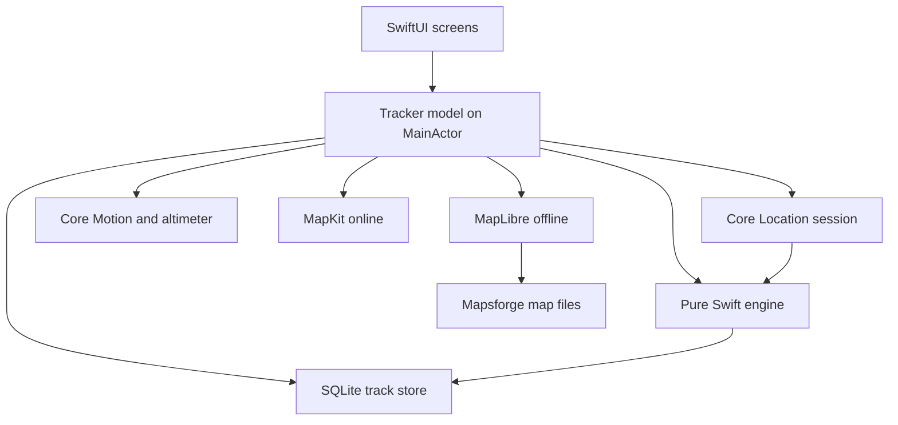
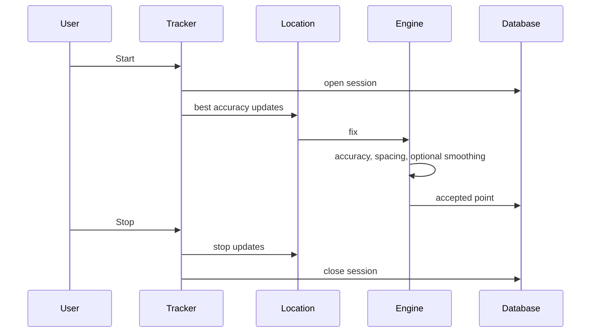

# GPS Track Logger

GPS Track Logger records a route on the iPhone and keeps the points in an on-device database. Saved tracks can be shared as GPX 1.1 or KMZ.

The Xcode project is `gtl.xcodeproj`. Sources live in `gtl/`. The shared scheme is `gtl`.

## Requirements

- Xcode with the iOS 17 SDK or newer
- An iPhone simulator, or an iPhone running iOS 17 or newer
- Swift 6

## Version and identity

| | |
| --- | --- |
| Display name | GPS Track Logger |
| Hungarian home-screen name | GTL GPS útvonal napló |
| Bundle identifier | `com.lkovari.mobile.apps.gtl` |
| Version | 2.0.15 |
| Build | 33 |
| Devices | iPhone only, portrait |
| Languages | English and Hungarian, following the system language |
| Appearance | Light and dark, following the system |

Signing is automatic and the development team is unset, so the simulator builds without a paid account. Archive and upload need the Apple Developer Program team selected in Xcode under Signing & Capabilities.

## Build, test, and run

Open `gtl.xcodeproj` and run the `gtl` scheme on an iPhone simulator.

From the command line, using an installed iPhone simulator:

```sh
xcodebuild -project gtl.xcodeproj -scheme gtl \
  -destination 'platform=iOS Simulator,name=iPhone 17' \
  -packageAuthorizationProvider netrc \
  CODE_SIGNING_ALLOWED=NO \
  test
```

If that simulator name is not installed, pick one from:

```sh
xcrun simctl list devices available
```

The unit tests cover recording filters, spacing, smoothing, barometric altitude, exports, and map math. The UI test launches the app, accepts the disclaimer, and checks that the tracker is on screen.

## Architecture



Recording stays off until a session starts. Location, motion, and the barometer run only while that session is open. Heading updates run for the Compass tab, and for the on-map pointer during a session.



## Screens

The first launch shows a disclaimer. Accept is stored on the device. Refuse closes the app.

The tracker has GPS, Route, Map, and Compass. The menu opens Settings, offline map downloads, saved tracks, Help, About, and Location settings. Tapping the version line on About seven times opens the error log.

Settings cover usage (Aircraft, Watercraft, Car, Motorbike, Bicycle, Run/Hike), metric / imperial / ICAO units, appearance, recording density, the barometer when the phone has one, and the layer switches for the map that is in use.

Saved tracks can be shared as GPX or KMZ, shown on the map, or deleted.

## Maps

Online maps use MapKit: standard, satellite, and hybrid. Place search on the online map uses MapKit local search.

Offline maps use one downloaded region at a time:

- OpenStreetMap regions from `https://download.mapsforge.org/maps/v5/`, with a 2 GB cap and a 64 MB free-space reserve
- Turistautak.hu from `https://turistautak.elte.hu/tuhu/tuhu_mapsforge.zip` only

MapKit cannot draw those files. The app reads the visible tiles from the Mapsforge file and draws them with MapLibre. Decoding runs off the main thread, is cancelled when the camera moves, and does not load a whole country into memory. MapLibre is created only while an offline map is in use.

The map shows OpenStreetMap ODbL attribution, or Turistautak.hu when that map is in use. Hillshade is drawn only when elevation files sit next to the map.

Place search on an offline map uses an on-device index. Queries start at 3 characters and return at most 5 hits.

## Privacy

The privacy manifest declares precise location for app functionality and UserDefaults reason `CA92.1`. The app does not track. `ITSAppUsesNonExemptEncryption` is false.

Purpose strings, in English and Hungarian:

- Location when in use
- Location always and when in use
- Motion

The only background mode is Location. Background location updates and the location indicator are turned on only while a session is logging, and only after Always authorization, then turned off when logging stops.

## A real iPhone

The simulator can show the screens and a simulated GPS location. These need a physical iPhone:

- A continuous track while the screen is locked
- Barometric altitude
- A usable compass heading

## Not available on iPhone

- Ambient temperature. The temperature row says that no sensor is available, and temperature is not stored.
- A separate terrain raster basemap. MapKit provides standard, satellite, and hybrid, including 3D elevation.
